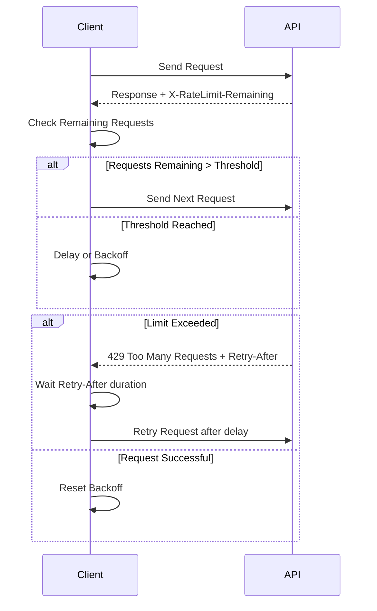

# Rate Limiting & Quotas

Understanding how API rate limits and quotas operate is critical for building robust integrations with the Dory REST API. This page guides you through the mechanics of rate limiting, quota enforcement, the headers you need to monitor, and best practices to gracefully handle throttling and avoid service disruptions.

---

## What Are Rate Limits and Quotas?

Rate limits and quotas are safeguards to ensure fair and stable use of the API. They prevent any single user or client from overloading the system, protecting service availability and performance for everyone.

- **Rate Limits**: Control how many requests a client can make within a short time frame (e.g., requests per second or minute).
- **Quotas**: Define longer-term usage caps such as daily or monthly request allotments.

Dory enforces these limits transparently and provides clear feedback to help clients regulate their consumption.

## Why Rate Limiting Matters

Imagine your integration suddenly sends hundreds or thousands of requests—due to an unexpected loop or spike. Without rate limits, the system could become overwhelmed, leading to degraded API responsiveness or outages. Dory’s rate limiting ensures:

- Consistent API responsiveness
- Equal opportunity for all API users
- Protection against abuse and accidental overuse

By respecting these limits, your applications remain stable and reliable.

## How Dory Enforces Rate Limits

Dory imposes rate limits on all API requests and returns informative response headers that describe your current usage and any restrictions in force:

### Key Response Headers

| Header               | Description                                                                |
|----------------------|----------------------------------------------------------------------------|
| `X-RateLimit-Limit`  | The maximum number of requests allowed in the current time window          |
| `X-RateLimit-Remaining` | The number of requests remaining before the limit is reached            |
| `X-RateLimit-Reset`  | Timestamp (Unix epoch seconds) when the current rate limit window resets  |

### Typical Rate Limit Workflow
1. **Make API Calls**: Your client sends requests as normal.
2. **Monitor Headers**: Check the returned headers to track how many requests remain.
3. **Adjust Behavior**: Slow down or pause requests as you approach the limit.
4. **Reset Wait**: When `X-RateLimit-Reset` time passes, your quota resets.

## What Happens When You Hit the Limit?

When you exceed rate limits, the API will respond with HTTP status code:

- `429 Too Many Requests`

### Response Details
- The response will include a `Retry-After` header indicating the number of seconds to wait before retrying.

### Best Practices After Hitting Limits
- **Respect `Retry-After`**: Do not send requests before this time elapses.
- **Implement Backoff**: Use exponential backoff with jitter to reduce request bursts.
- **Log and Alert**: Notify your operations team if limits are regularly hit, which may indicate a need to optimize or request an increased quota.

<Tip>
Always implement graceful handling of `429` responses to maintain good API citizenship and a smooth user experience.
</Tip>

## Monitoring Your API Usage

### Using Response Headers
Dory’s API allows you to track consumption in real-time via rate limit headers. Your client should parse and act on these headers after each response:

```http
X-RateLimit-Limit: 1000
X-RateLimit-Remaining: 250
X-RateLimit-Reset: 1700000000
```

- Here, you have 250 requests left before the limit resets at Unix time `1700000000`.

### Implementing Client-side Monitoring
- Build counters or dashboards that track rate limit usage.
- Trigger warnings or slow requests down as you approach the limit.
- Consider distributing requests to smooth spikes.

## Example: Handling Rate Limits in a Friendly Way

Suppose your application polls a resource frequently. Here’s a simplified flow:

1. **Before Request:** Check `X-RateLimit-Remaining`. If below a threshold (e.g., 10 requests), delay sending.
2. **On `429` Response:** Read `Retry-After` header and schedule retry after indicated time.
3. **Backoff Strategy:** Each consecutive `429` doubles the wait time plus adds random jitter.
4. **Success:** Reset backoff once request succeeds without hitting limits.

This approach minimizes disruptions and avoids unnecessary retries.

## Practical Tips to Avoid Being Throttled

- Use pagination and filtering to reduce the number of requests.
- Cache API responses when appropriate to limit repeat calls.
- Batch requests where the API supports it.
- Distribute load over time rather than bursts.
- Monitor your application logs for rate limit warnings.

<Check>
Before deploying, simulate rate limit scenarios to verify your client gracefully recovers from throttling.
</Check>

## Troubleshooting Rate Limit Issues

### Common Situations
- **Unexpected `429` Errors:** Check if your app is sending excessive requests or has retry loops.
- **Headers Missing or Inaccurate:** Ensure your client is capturing response headers correctly.
- **High Traffic Spikes:** Apply rate limiting safeguards on client-side logic.

### Suggestions
- Use exponential backoff on retries.
- Review your usage patterns and optimize bulk data fetching.
- Contact support if you consistently hit limits and need a higher quota.

---

## Summary

Rate limiting is a vital part of integrating reliably with Dory’s API. By understanding the headers provided, monitoring your request usage closely, and implementing backoff and retry strategies, you can build robust applications that avoid throttling and maintain smooth operation.

For interactive client testing of API behavior including response headers, try the [API Playground](https://your-docs-site.com/api-reference/rest-api/rest-examples-sdks).

---

## Related Documentation

- [Authentication & Authorization](/api-reference/rest-api/rest-authentication): Learn how secure authentication works alongside rate limits.
- [Error Handling & Status Codes](/api-reference/rest-api/rest-errors-status): Understand API error responses including `429` status.
- [API Endpoints & Operations](/api-reference/rest-api/rest-endpoints): Explore the API surface while respecting limits.
- [API Playground & SDK Integration](/api-reference/rest-api/rest-examples-sdks): Use the interactive playground for testing rate limit behavior.

---

## Diagram: Rate Limit Lifecycle


This flow guides applications to request responsibly and recover smoothly from throttling.

---