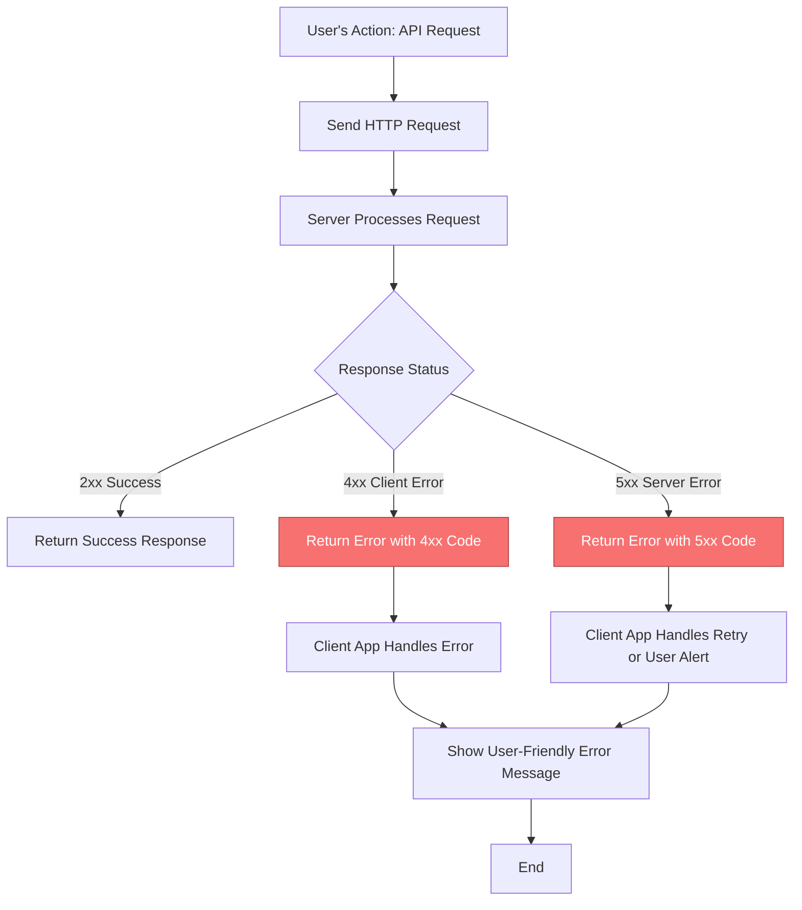

# Error Handling & Status Codes

Welcome to the comprehensive reference for understanding error responses and HTTP status codes in the Dory API ecosystem. This guide will empower you to interpret API errors confidently, use standard and custom status codes effectively, and implement resilient error handling strategies in your applications.

---

## Why Understanding API Errors Matters

When integrating with any API, encountering errors is inevitable. Clear knowledge of what each error means and how to respond ensures that your application can handle issues gracefully instead of failing unexpectedly. This page arms you with that clarity.

---

## HTTP Status Codes Overview

HTTP status codes communicate the server's response to your API request. They fall into five broad categories:

- **1xx Informational** – Communicate provisional responses; rarely relevant in REST APIs.
- **2xx Success** – Indicate the request was successfully processed.
- **3xx Redirection** – Indicate further action is needed to complete the request.
- **4xx Client Errors** – Signal problems with the request sent by the client.
- **5xx Server Errors** – Indicate server-side failures.

### Common Status Codes in Dory APIs

| Code | Meaning                                 | When to Expect                   | What You Should Do                   |
|-------|-----------------------------------------|---------------------------------|------------------------------------|
| 200   | OK – Successful GET, PUT, or POST       | Normal successful operations     | Proceed normally                    |
| 201   | Created – Resource successfully created | After POST request creating data | Use returned data to update UI     |
| 204   | No Content – Successful DELETE operation | After deleting a resource         | Remove the resource from UI         |
| 400   | Bad Request                            | Invalid client request data      | Validate inputs before retrying    |
| 401   | Unauthorized                          | Missing or invalid authentication | Check auth token or credentials    |
| 403   | Forbidden                            | Insufficient permissions         | Verify user roles and permissions  |
| 404   | Not Found                           | Requested resource does not exist | Confirm resource identifier        |
| 429   | Too Many Requests                    | Rate limit exceeded              | Implement retry with backoff       |
| 500   | Internal Server Error                | Unexpected server failure        | Report issue; retry if appropriate |

---

## Standard Error Response Structure

When an error occurs, the API returns a JSON response with the following structure to help explain the issue clearly:

```json
{
  "code": "ERROR_CODE",
  "message": "Detailed explanation of the error"
}
```

- **code**: A string identifying the error type.
- **message**: Human-readable description providing more context.

### Example: Unauthorized Access

```http
HTTP/1.1 401 Unauthorized
Content-Type: application/json

{
  "code": "UNAUTHORIZED",
  "message": "Authentication token is missing or invalid."
}
```

Use this information to inform the user and prompt re-authentication.

---

## Custom Error Codes & Meaning

Beyond standard HTTP codes, Dory APIs use specific custom error codes for clarity:

| Custom Code          | Meaning                                            | Recommended Handling                        |
|---------------------|----------------------------------------------------|--------------------------------------------|
| VALIDATION_FAILED   | Input data failed validation rules                  | Highlight specific fields and correct input |
| RESOURCE_NOT_FOUND  | Resource with given identifier does not exist       | Show friendly not-found message             |
| AUTHENTICATION_FAILED | Unable to authenticate with provided credentials   | Prompt user to login or check credentials  |
| PERMISSION_DENIED   | Authenticated user lacks permission for action     | Inform user about insufficient permissions |
| RATE_LIMIT_EXCEEDED | Client has sent too many requests in a timeframe   | Retry after waiting or throttle requests  |
| SERVER_ERROR        | Internal error, something went wrong on the server | Retry later; log issue for support          |

---

## Best Practices for Handling Errors

- **Always Check HTTP Status**: Base your error logic primarily on status codes.
- **Parse and Display Error Messages**: Extract helpful messages from the API response to inform users.
- **Implement Exponential Backoff**: For rate limits or transient server errors, retry requests with increasing delay.
- **Validate Inputs Client-Side**: Catch common issues early to avoid 400 errors.
- **Securely Handle Authentication Failures**: Prompt for re-login or token refresh carefully.
- **Log Errors for Diagnostics**: Capture error details for later analysis.

---

## Troubleshooting Common Issues

### 1. Receiving 400 Bad Request

- **Cause**: Invalid or missing parameters.
- **Solution**: Validate your input data types, required fields, and formats before sending.

### 2. Authentication Errors (401 or 403)

- **Cause**: Expired token or insufficient permission.
- **Solution**: Refresh your access token or check your user’s access scopes.

### 3. Rate Limit Hit (429)

- **Cause**: Too many requests sent in a short period.
- **Solution**: Implement request throttling and retry after the duration specified in response headers if provided.

### 4. Server Errors (500+)

- **Cause**: Unexpected issues on the server.
- **Solution**: Retry after some time; if persistent, contact support.

---

## Sample Error Response in a Real Endpoint

For instance, the **Products API** returns errors like these:

```http
HTTP/1.1 404 Not Found
Content-Type: application/json

{
  "code": "RESOURCE_NOT_FOUND",
  "message": "Product with ID '123' not found."
}
```

Use this response to display a meaningful message in your app when product data is missing.

---

## Integrating Error Handling in Client Applications

Below is an example showing how you might handle errors when calling the API using `fetch`:

```javascript
async function fetchProduct(productId) {
  try {
    const response = await fetch(`/products/${productId}`, {
      headers: { 'X-API-Key': 'your-api-key' }
    })

    if (!response.ok) {
      const errorData = await response.json()
      throw new Error(`${errorData.code}: ${errorData.message}`)
    }

    const product = await response.json()
    return product
  } catch (error) {
    console.error('Failed to fetch product:', error.message)
    // Show user-friendly error UI
  }
}
```

---

## Summary

Effective error handling in your applications leads to better resilience, user satisfaction, and easier debugging. Reference this documentation whenever you integrate or debug Dory APIs to build robust client experiences.

For a live experience, explore our interactive API Playground which illustrates errors and responses dynamically in real time.

---

## Related Documentation

- [Endpoints & Operations](./rest-endpoints) – Detailed API methods and their expected responses
- [Authentication & Authorization](./rest-authentication) – How to secure your API requests
- [API Playground Demo](../../api-playground-demo) – Interactive testing tool to simulate requests and errors
- [WebSocket & Real-Time APIs](../websocket-apis/ws-playground) – Real-time error handling and status codes for WebSockets

---

<Link to="/api-reference/rest-api/rest-errors-status" />

---

## Visual Flow: Handling an API Error Response



---