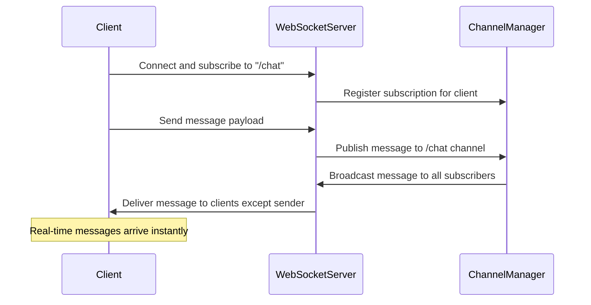

# Channels & Real-Time Operations

Explore all supported WebSocket channels and understand how to send and receive real-time messages through them. This documentation covers subscribing and publishing operations on each channel, detailed message payload schemas, practical examples, and guidance for integrating these real-time capabilities into your applications.

---

## Overview

WebSocket communication in this API revolves around **channels**, which represent logical streams of real-time messages. Each channel supports specific operations for sending (`publish`) and receiving (`subscribe`) messages.

This page focuses on the WebSocket channels available, including their message formats, usage patterns, and schemas to enable seamless real-time chat, notifications, and presence updates.

---

## Available Channels and Operations

### /chat

- **Subscribe (`/chat`)**: Receive chat messages sent by other users in real-time.
- **Publish (`/chat`)**: Send a chat message to other users.

This channel is the primary conduit for bidirectional chat messaging.

### /notifications

- **Subscribe (`/notifications`)**: Receive system-generated notifications instantly.

This channel allows clients to listen for updates such as alerts or announcements.

### /presence

- **Subscribe (`/presence`)**: Receive updates about user presence statuses (online, offline, away, busy).
- **Publish (`/presence`)**: Send updates about your own presence state.

This channel facilitates awareness of who's online and their availability.

---

## Operation Details

### Subscribe to /chat - Receive Chat Messages

Subscribe to `/chat` to listen for new messages posted by other connected users.

This is a real-time stream; your client will get pushed chat messages as they occur.

#### Message Payload Structure

```json
{
  "id": "msg_123",
  "type": "message",
  "content": "Hello, how are you?",
  "userId": "user_456",
  "username": "john_doe",
  "timestamp": "2024-01-15T10:30:00Z",
  "channel": "general",
  "replyTo": "msg_122"  
}
```

| Field     | Type   | Description                               | Required |
|-----------|--------|-------------------------------------------|----------|
| id        | string | Unique identifier of the message           | Yes      |
| type      | string | Fixed value: 'message'                     | Yes      |
| content   | string | The text content of the chat message      | Yes      |
| userId    | string | ID of the sending user                      | Yes      |
| username  | string | Display username of the sender              | Yes      |
| timestamp | string | ISO-8601 timestamp when message was sent   | Yes      |
| channel   | string | The chat channel or room name               | No       |
| replyTo   | string | If replying, the ID of the original message | No       |

#### Headers

Messages include optional headers for tracking and correlation:

| Header          | Type   | Description                         |
|-----------------|--------|-------------------------------------|
| correlation-id  | string | Request tracking correlation ID    |
| user-id        | string | User ID sending the message         |
| session-id     | string | Connection session identifier       |
| client-version | string | Client app version                  |

#### Example Received Message

```json
{
  "id": "msg_123",
  "type": "message",
  "content": "Hello, how are you?",
  "userId": "user_456",
  "username": "john_doe",
  "timestamp": "2024-01-15T10:30:00Z",
  "channel": "general"
}
```

---

### Publish to /chat - Send Chat Messages

To send a chat message, publish to the `/chat` channel.

Your message should conform to the same payload structure described above.

#### Usage Steps

1. Establish a WebSocket connection to the `/chat` channel.
2. Send a JSON message following the chat message schema.
3. Optionally include the `replyTo` field to reply to a specific message.

#### Sending Example

```json
{
  "id": "msg_124",
  "type": "message",
  "content": "I'm good, thanks!",
  "userId": "user_456",
  "username": "john_doe",
  "timestamp": "2024-01-15T10:31:00Z",
  "channel": "general"
}
```

---

### Subscribe to /notifications - Receive System Notifications

Subscribe to `/notifications` to receive important system messages such as alerts, status updates, or event notifications.

#### Notification Payload Structure

```json
{
  "id": "notif_789",
  "type": "notification",
  "title": "New Message",
  "message": "You have a new message from Alice",
  "level": "info",
  "timestamp": "2024-01-15T10:35:00Z",
  "userId": "user_456",
  "actionUrl": "/chat/general"
}
```

| Field      | Type   | Description                                     | Required |
|------------|--------|-------------------------------------------------|----------|
| id         | string | Unique notification identifier                    | Yes      |
| type       | string | Fixed value: 'notification'                      | Yes      |
| title      | string | Brief title of the notification                   | Yes      |
| message    | string | Detailed notification message                     | Yes      |
| level      | string | Notification level (info, warning, error, success) | Yes    |
| timestamp  | string | Time notification was created (ISO-8601)         | Yes      |
| userId     | string | User ID receiving the notification                | No       |
| actionUrl  | string | URL to navigate to when notification clicked     | No       |

---

### Subscribe and Publish to /presence - User Presence Updates

Manage real-time presence awareness with the `/presence` channel.

#### Subscribe

Receive others' presence updates.

#### Publish

Announce your own presence status.

#### Presence Update Payload Structure

```json
{
  "id": "presence_101",
  "type": "presence",
  "userId": "user_456",
  "username": "john_doe",
  "status": "online",
  "lastSeen": "2024-01-15T10:40:00Z",
  "timestamp": "2024-01-15T10:40:00Z"
}
```

| Field      | Type   | Description                              | Required |
|------------|--------|------------------------------------------|----------|
| id         | string | Unique presence update ID                 | Yes      |
| type       | string | Fixed value: 'presence'                   | Yes      |
| userId     | string | User whose presence is updated            | Yes      |
| username   | string | Username of the user                      | Yes      |
| status     | string | Status: online, offline, away, busy      | Yes      |
| lastSeen   | string | Last seen timestamp (ISO-8601)           | No       |
| timestamp  | string | Timestamp update was sent (ISO-8601)     | Yes      |

---

## Integration & Usage Tips

- **Consistent IDs:** Use unique message and presence IDs to track events reliably.
- **Timestamps:** Ensure all timestamps follow the ISO 8601 format.
- **Headers:** Use headers for correlating requests and debugging.
- **Subprotocols:** Use appropriate WebSocket subprotocols if required (e.g., "chat.v1", "json").
- **Authentication:** Authenticate your WebSocket connection as needed to prevent unauthorized access.

---

## Practical Example

Connecting to the `/chat` channel to listen and send messages can be accomplished via the WebSocket playground or your client code:

```javascript
const ws = new WebSocket('wss://api.example.com/ws/chat');

ws.onmessage = (event) => {
  const message = JSON.parse(event.data);
  console.log('Received message:', message);
};

ws.onopen = () => {
  const chatMessage = {
    id: 'msg_125',
    type: 'message',
    content: 'Hey there! Anyone around?',
    userId: 'user_789',
    username: 'jane_doe',
    timestamp: new Date().toISOString(),
    channel: 'general'
  };

  ws.send(JSON.stringify(chatMessage));
};
```

---

## Message Schemas

### ChatMessagePayload

| Name      | Type   | Description                        | Required |
|-----------|--------|------------------------------------|----------|
| id        | string | Unique message ID                   | Yes      |
| type      | string | Fixed: "message"                  | Yes      |
| content   | string | Text of the chat message           | Yes      |
| userId    | string | Sender's user ID                   | Yes      |
| username  | string | Sender's display username          | Yes      |
| timestamp | string | ISO timestamp of sending time     | Yes      |
| channel   | string | Channel or room name               | No       |
| replyTo   | string | Message ID being replied to        | No       |

### NotificationPayload

| Name       | Type   | Description                      | Required |
|------------|--------|----------------------------------|----------|
| id         | string | Unique notification ID           | Yes      |
| type       | string | Fixed "notification"           | Yes      |
| title      | string | Title of the notification        | Yes      |
| message    | string | Notification content            | Yes      |
| level      | string | Level: info, warning, error, success | Yes  |
| timestamp  | string | ISO timestamp                   | Yes      |
| userId     | string | Recipient user                   | No       |
| actionUrl  | string | URL for notification action      | No       |

### PresenceUpdatePayload

| Name       | Type   | Description                     | Required |
|------------|--------|---------------------------------|----------|
| id         | string | Unique presence update ID        | Yes      |
| type       | string | Fixed "presence"              | Yes      |
| userId     | string | User presence pertains to        | Yes      |
| username   | string | User's display username          | Yes      |
| status     | string | online, offline, away, busy     | Yes      |
| lastSeen   | string | ISO last seen timestamp          | No       |
| timestamp  | string | ISO timestamp sent               | Yes      |

### MessageHeaders

| Name           | Type   | Description                     |
|----------------|--------|---------------------------------|
| correlation-id | string | Correlation ID for tracking     |
| user-id        | string | ID of the message sender        |
| session-id     | string | Connection session identification|
| client-version | string | Client application version       |

---

## Troubleshooting & Best Practices

<Warning>
Ensure your client correctly handles WebSocket reconnections to maintain the subscription to real-time channels without missing messages.
</Warning>

<Tip>
Use timestamps and unique IDs to detect and prevent duplicate messages in your application UI.
</Tip>

<Note>
Authentication tokens must be sent as part of the WebSocket handshake headers or query parameters, depending on your server configuration.
</Note>

<Callout>
Include robust error handling on connection loss and server errors to improve user experience.
</Callout>

---

## Visualizing the Real-Time Chat Flow



---

## Related Documentation

- [WebSocket Authentication](./ws-auth)
- [WebSocket Playground & Examples](./ws-playground)
- [AsyncAPI WebSocket Guide](../../guides/api-and-interactive-guides/websocket-guide)
- [REST API Endpoints & Operations](../rest-api/rest-endpoints)

---