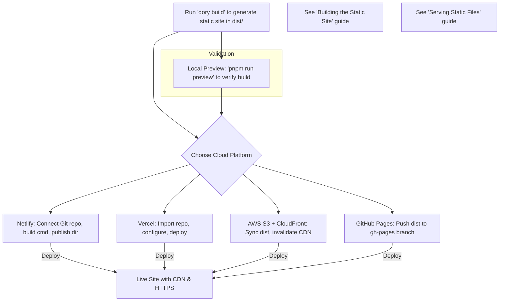

# Deploying to Cloud Platforms

Quick guides to help you deploy Dory-generated static documentation sites to popular cloud platforms and static-site hosts such as Netlify, Vercel, AWS S3, and GitHub Pages. Learn about configuration essentials, common pitfalls, and platform-specific optimizations to ensure smooth, reliable deployments.

---

## Why Deploy to Cloud Platforms?

Dory produces fully static sites optimized for technical documentation. Deploying these sites to cloud hosts unlocks scalable, secure, and fast global delivery, eliminating the need for your own infrastructure.

Cloud deployment providers offer built-in HTTPS, automatic CDN caching, and simple continuous deployment from your Git repository — making them ideal for sharing docs with your users or teams without hassle.

This page guides you through typical deployment workflows, tailored configuration notes, and best practices for each platform.

---

## Before You Begin: Prerequisites

Before deploying your Dory site to any cloud platform, ensure:

- You have run `pnpm run build` (or `dory build`) to generate your static site in the `dist/` directory.
- Your documentation content and `dory.json` configuration are complete and validated.
- You have an account set up on the target deployment platform.

<Tip>
Always preview your static build locally using `pnpm run preview` to verify rendering before deployment.
</Tip>

---

## 1. Deploying to Netlify

Netlify is a leading static site host with a seamless Git-based deployment workflow.

### Step-by-Step Guide

1. Log in to your [Netlify](https://netlify.com) account.
2. Click “New site from Git” and connect your repository where your Dory docs project resides.
3. Choose your branch to deploy (usually `main`).
4. Set the **build command** to:

```bash
dory build
```

or

```bash
pnpm run build
```

5. Set the **publish directory** to:

```plaintext
dist
```

6. Deploy the site.

### Configuration Tips

- Use the [`DORY_BASE_PATH`](https://github.com/clidey/dory#configuration) environment variable if your site is served from a subpath.
- Enable branch deploy previews for staging.
- Add `_redirects` file if SPA routing is needed.

<Warning>
Netlify caches dependencies; if your build fails due to stale cache, clear the cache in settings and retry.
</Warning>

---

## 2. Deploying to Vercel

Vercel offers first-class support for static sites and serverless functions with effortless Git integration.

### Deployment Workflow

1. Sign in to [Vercel](https://vercel.com).
2. Import your Dory project repository.
3. In the project settings, set:

   - **Framework preset**: `Other`
   - **Build Command**:

```bash
pnpm run build
```

or

```bash
dory build
```

   - **Output Directory:**

```plaintext
dist
```

4. Deploy.

### Best Practices

- Use Environment Variables to adjust configuration like base path.
- Enable automatic Git-based deployments on push.
- Preview builds occur automatically on pull requests.

<Note>
Vercel automatically uses a CDN, so your docs will load quickly worldwide with minimal configuration.
</Note>

---

## 3. Deploying to AWS S3 and CloudFront

Use Amazon S3 as a static file host along with CloudFront CDN for global caching.

### Pre-Deployment Setup

- Create an S3 bucket with static website hosting enabled.
- Configure bucket policies to allow public read access (or restrict via CloudFront).
- Set up a CloudFront distribution pointing at your S3 bucket.

### Deploying Your Site

1. Use AWS CLI or your deployment tool to sync the `dist/` folder to your S3 bucket:

```bash
aws s3 sync dist/ s3://your-bucket-name/ --delete
```

2. Invalidate CloudFront cache to propagate updates:

```bash
aws cloudfront create-invalidation --distribution-id YOUR_DISTRIBUTION_ID --paths "/*"
```

### Key Recommendations

- Automate deployments with CI workflows (e.g., GitHub Actions) using these commands.
- Use CloudFront HTTPS with an SSL certificate for secure delivery.
- Ensure your site uses relative URLs or configures the correct base path.

<Warning>
Be cautious with bucket permissions. Avoid making your bucket publicly writable.
</Warning>

---

## 4. Deploying to GitHub Pages

GitHub Pages is a convenient static hosting service built into GitHub repositories.

### Deployment Steps

1. Build your site with `pnpm run build`.
2. Commit and push your `dist/` contents to the `gh-pages` branch:

One approach using the [`gh-pages`](https://github.com/tschaub/gh-pages) npm package:

```bash
npm install -g gh-pages

gh-pages -d dist
```

3. In your GitHub repo settings, enable GitHub Pages to serve from the `gh-pages` branch.

### Important Considerations

- GitHub Pages serves from a fixed path. If your docs reside in a repo root or subfolder, configure the `basePath` accordingly.
- Custom domain support is available via your repo settings.

<Info>
GitHub Pages has a soft limit on file size and build frequency — suitable for small to medium documentation projects.
</Info>

---

## Common Configuration Gotchas Across Platforms

- **Base Path (Base URL)**: If your site is not served at root `/`, ensure you set `basePath` in `dory.json` or environment accordingly.
- **Redirects and SPA Routing**: Add redirect rules (`_redirects` for Netlify, or proper HTTP rules) to support client-side navigation.
- **Caching Invalidation**: After deployment, invalidate CDN caches if applicable to immediately update site content.
- **Environment Variables**: Use platform environment variables to customize deployment without hardcoding paths.

---

## Troubleshooting Deployment Issues

<AccordionGroup title="Common Issues & Solutions">
<Accordion title="Site Does Not Load After Deployment">
Check that the publish directory is correctly pointed to `dist` and a valid build exists. Ensure your base URL or path settings match the deployed URL.
</Accordion>
<Accordion title="Broken Links or Missing Assets">
Verify your `basePath` or `DORY_BASE_PATH` environment variable matches the deployment subdirectory. Relative URLs work best for portability.
</Accordion>
<Accordion title="Build Fails on Platform">
Ensure the build command is correct and all dependencies installed before building. Clear caches if stale.
</Accordion>
<Accordion title="404 on Refresh with SPA Behavior">
Add appropriate redirect rules (_redirects on Netlify or config for others) to redirect all requests to `index.html`.
</Accordion>
<Accordion title="Authentication or Access Denied">
Check bucket or repository permissions if hosting on S3 or GitHub Pages. Make sure your files and folders are public/readable as required.
</Accordion>
</AccordionGroup>

---

## Final Recommendations

- Always test your build locally before deploying with `pnpm run preview`.
- Use CI/CD integration of your chosen platform to automate deployments on Git pushed.
- Monitor logs and error messages on your hosting platform to catch issues early.
- Leverage platform documentation for advanced features like preview URLs, environment secrets, and custom domains.

---

## Additional Resources

- [Dory CLI and Build Reference](https://github.com/clidey/dory#cli)
- [Netlify Docs - Deploying Static Sites](https://docs.netlify.com/site-deploys/create-deploys/)
- [Vercel Static Site Deployment](https://vercel.com/docs/concepts/deployments/overview)
- [AWS S3 Static Website Hosting](https://docs.aws.amazon.com/AmazonS3/latest/userguide/WebsiteHosting.html)
- [GitHub Pages Guide](https://docs.github.com/en/pages)

---

For more on building the static site and serving files, please see the [Building the Static Site](../getting-started-production/building-static-site) and [Serving Static Files](../getting-started-production/serving-static-files) guides.


---

## Summary Diagram: Deployment Flow



---

This completes the essential cloud deployment guidance for your Dory-generated documentation sites. With these steps, you can confidently deliver fast, secure, and globally accessible docs on your preferred platform.
