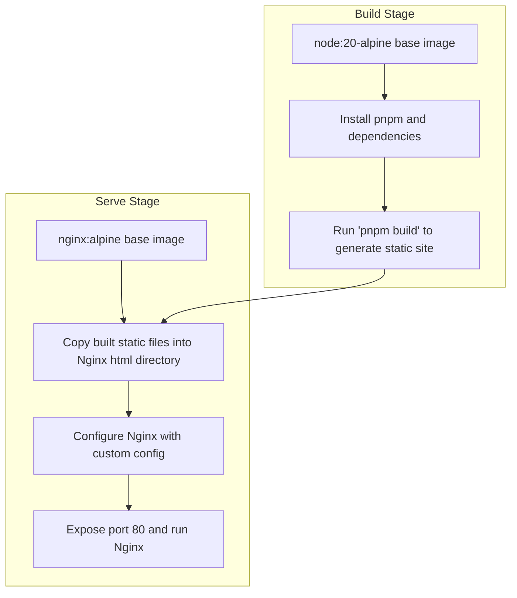

# Deploying with Docker

This guide provides a comprehensive walkthrough for building and running your static documentation site in a Docker container using Dory’s official base images and custom Dockerfiles. Whether you want a development environment or a production-ready container serving your built static site, this page covers all essential steps and best practices.

---

## Why Use Docker for Dory?

Docker simplifies environment setup and deployment by packaging your documentation site with all dependencies and configs in a self-contained container. You can run your docs consistently across any host machine, easily migrate between environments, and enable smoother CI/CD workflows.

With Docker, you have two main modes:

- **Development**: Run the docs site with live reload for fast editing and preview.
- **Production**: Build a static site and serve it efficiently with a lightweight web server like Nginx.


## 1. Official Base Images Overview

Dory provides official Docker images designed for easy local preview and static site serving.

- **`clidey/dory`**: A base image with the Dory CLI installed, used for building and previewing docs
- **`node:20-alpine` and `nginx:alpine`**: Used in multi-stage Dockerfiles for building static assets and serving them

You can start with these images to build custom containers tailored to your needs.


## 2. Building Your Static Site with Docker

You can build your documentation site inside a Docker container using a multi-stage Dockerfile. The build stage compiles your MDX files into static HTML, and the second stage serves the site with Nginx.

### Example: Production Dockerfile

```dockerfile
# Build Stage
FROM node:20-alpine AS builder

# Enable pnpm via corepack and set working directory
RUN corepack enable && corepack prepare pnpm@10.10.0 --activate
WORKDIR /app

# Copy dependency manifests and install packages
COPY package.json pnpm-lock.yaml ./
RUN pnpm install --frozen-lockfile

# Copy source and build static site
COPY . .
RUN pnpm build

# Serve Stage
FROM nginx:alpine

# Copy built static files from builder stage
COPY --from=builder /app/dist /usr/share/nginx/html

# Copy a custom nginx config (optional)
COPY --from=builder /app/k8s/config/nginx-default.conf /etc/nginx/conf.d/default.conf

# Expose HTTP default port
EXPOSE 80

# Start Nginx in foreground mode
CMD ["nginx", "-g", "daemon off;"]
```

### How to Build and Run

1. Build your Docker image (tag it as appropriate):

```bash
docker build -f k8s/Dockerfile --tag docs:1.0.0 .
```

2. Run the container:

```bash
docker run -it -p 8080:80 docs:1.0.0
```

3. Access your docs at [http://localhost:8080](http://localhost:8080).


## 3. Running Dory in Development Mode with Docker

For rapid editing and live preview, you can build a container that runs the development server with hot reload.

### Example: Development Dockerfile

```dockerfile
FROM node:22.16-alpine

WORKDIR /app

# Enable corepack and install dependencies
RUN corepack enable && corepack prepare pnpm@latest --activate
RUN apk add --no-cache git

# Copy dependency files and install
COPY package.json pnpm-lock.yaml ./
RUN pnpm i

# Copy all source files
COPY . .

# Remove pre-existing data if necessary
RUN rm -rf /app/src/data

# Expose development server port
EXPOSE 3000

# Run the development server accessible externally
CMD ["pnpm", "dev", "--host", "0.0.0.0", "--port", "3000"]
```

### Running the Development Container

Build and run as usual:

```bash
docker build -f k8s/dev.Dockerfile -t docs-dev:latest .
docker run -it -p 3000:3000 docs-dev:latest
```

Your live reload development server will be available at [http://localhost:3000](http://localhost:3000).


## 4. Using the Official Lightweight Dory Docker Image

If you prefer not to build your own images, use the official `clidey/dory` image on Docker Hub.

### Simple Dockerfile example

```dockerfile
FROM clidey/dory
WORKDIR /app
COPY . .
RUN dory build
CMD ["dory", "preview"]
```

Build and run with:

```bash
docker build -t mydocs:latest .
docker run -it -p 3000:3000 mydocs:latest
```

This image installs the Dory CLI globally and runs the preview server on port 3000.


## 5. Best Practices and Tips

- **Use Multi-Stage Builds**: They keep your production images small by separating build-time dependencies from runtime.
- **Custom Nginx Configuration**: Tailor the Nginx conf file (`nginx-default.conf`) for your needs, such as supporting SPA fallback routing or cache headers.
- **Expose Correct Ports**: Match your container's exposed ports to host ports consistently.
- **File Volumes for Development**: For live editing in Docker, you can mount your local docs folder as a volume into the container.
- **Avoid Committing Node Modules**: Use `.dockerignore` to exclude unwanted files (`node_modules`, `.git`, etc.) to speed up build context upload.


## 6. Troubleshooting Common Docker Issues

<AccordionGroup title="Common Issues and Resolutions">
<Accordion title="Build Failures Due to Dependency Resolution">
Ensure your `pnpm-lock.yaml` and `package.json` are copied before running `pnpm install`. Use `--frozen-lockfile` to enforce lock consistency.
</Accordion>
<Accordion title="Port Conflicts on Host Machine">
Make sure the ports you map (`-p` flags) are free. Use `lsof -i :PORT` to check what is occupying the port.
</Accordion>
<Accordion title="Static Site Not Showing Correctly in Container">
Verify the static files are copied correctly in the Nginx stage, and that Nginx is serving the correct directory.
Check your Nginx config for correct root path and fallback rules.
</Accordion>
<Accordion title="File Sync Issues in Development Mode">
When mounting local folders as volumes, ensure file permissions allow reading/writing inside the container.
Avoid caching issues by restarting the container if necessary.
</Accordion>
</AccordionGroup>


## 7. Summary

With Docker, you can effortlessly containerize your Dory documentation projects, whether for quick developer previews or scalable, production-ready static hosting. Use the official images or customize your own multi-stage Dockerfile for finer control.

Following this guide will enable you to:

- Build your static docs in a reproducible container environment.
- Serve static sites efficiently with Nginx containers.
- Run a hot reload development server inside Docker.
- Integrate Docker deployment seamlessly into your CI/CD pipelines.


---

## Additional Resources

- [Dory CLI Usage](https://github.com/clidey/dory#cli-usage)
- [Building Static Sites](../../deployment/getting-started-production/building-static-site)
- [Serving Static Files](../../deployment/getting-started-production/serving-static-files)
- [Docker Installation & Setup](../../getting-started/prerequisites-installation/install-docker)


---

## References

- Official Dory Dockerfile for production: `k8s/docs.Dockerfile`
- Development Dockerfile example: `k8s/dev.Dockerfile`
- Lightweight Dory image Dockerfile: `k8s/Dockerfile`


---

## Example Workflow Diagram



This clearly illustrates the multi-stage build flow, separating concerns and optimizing the final image size.


---

Your Dory-powered docs site is now ready to run in Docker containers with full development and production workflows covered.