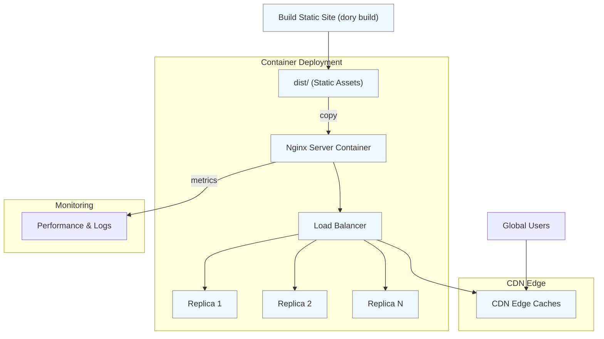

# Scaling and Performance Optimization

Optimizing the scalability and performance of your Dory documentation site is essential to delivering a fast, reliable user experience worldwide. This guide outlines practical strategies and best practices for scaling your static site, configuring caching and CDNs, and leveraging container and cloud deployment optimizations.

---

## Why Scaling Matters for Dory Sites

Although Dory outputs static sites optimized for simplicity and speed, performance can vary significantly depending on how you serve your content in production. Proper scaling ensures:

- Fast page loads, even under heavy traffic
- Global availability with minimal latency
- Efficient resource use to control hosting costs
- Reliability and uptime during peak demand

By implementing the following techniques, you can harness Dory’s lightweight nature while maximizing delivery speed and user satisfaction.

---

## 1. Leveraging Content Delivery Networks (CDNs)

CDNs are critical for scaling static sites globally. They cache your documentation site's assets at edge servers worldwide, significantly reducing latency.

### Best Practices for CDN Usage

- **Choose a CDN with global presence:** Popular providers like Cloudflare, AWS CloudFront, or Fastly provide vast networks that cover all major regions.
- **Cache all static assets:** Your HTML, CSS, JS, images, fonts, and documentation files should be cached aggressively with proper cache-control headers.
- **Enable compression:** Use gzip or Brotli on CDN edge to reduce payload sizes.
- **Utilize cache invalidation:** When you deploy updates, invalidate relevant paths to serve fresh content without delay.

### Example Cache-Control Headers

```http
Cache-Control: public, max-age=31536000, immutable
```

Use long max-age for versioned assets; for HTML or index files, use a shorter TTL or stale-while-revalidate strategies.

<Note>
Integrating CDN correctly transforms your Dory site into a globally available, lightning-fast resource without additional infrastructure complexity.
</Note>

---

## 2. Intelligent Caching Strategies

Caching is your first line of defense against bottlenecks.

- **Browser Caching:** Set appropriate HTTP headers to ensure repeat visitors load the site instantly.
- **Reverse Proxy Caching:** When using Nginx or similar, configure caching layers to serve static content efficiently.
- **Immutable Asset Handling:** Since Dory generates static files with hashed names on rebuilds, immutable caching is safe and recommended.

### Example: Nginx Configuration for Caching

```nginx
location / {
    root /usr/share/nginx/html;
    try_files $uri /index.html;

    # Cache static files for 1 year
    location ~* \.(js|css|png|jpg|jpeg|gif|svg|woff2?|ttf|otf)$ {
        expires 365d;
        add_header Cache-Control "public, immutable";
    }

    # Cache HTML files for 10 minutes
    location ~* \.html$ {
        expires 10m;
        add_header Cache-Control "public, must-revalidate";
    }
}
```

<Warning>
Do not cache the root index.html indefinitely without revalidation, as your documentation updates need to propagate to users.
</Warning>

---

## 3. Optimizing for Fast Global Delivery

To make your documentation site responsive globally:

- **Deploy in regions close to your user base:** When using cloud platforms, select data centers nearest to your audience.
- **Enable HTTP/2:** Improves multiplexing and reduces latency on asset delivery.
- **Preload key assets:** Use `<link rel="preload">` for fonts or critical JS/CSS to speed up perceived load times.
- **Minify assets:** Dory’s build includes minified output; ensure no local changes break this.

---

## 4. Container and Cloud Best Practices

While Dory’s static output can be served from any static host, Docker and cloud deployments enable greater control and scalability.

### Container Deployment Tips

- Use the official multi-stage `Dockerfile` to build and serve your static site efficiently with Nginx:

```Dockerfile
FROM node:20-alpine AS builder

RUN corepack enable && corepack prepare pnpm@10.10.0 --activate
WORKDIR /app
COPY package.json pnpm-lock.yaml ./
RUN pnpm install --frozen-lockfile
COPY . .
RUN pnpm build

FROM nginx:alpine
COPY --from=builder /app/dist /usr/share/nginx/html
COPY --from=builder /app/k8s/config/nginx-default.conf /etc/nginx/conf.d/default.conf
EXPOSE 80

CMD ["nginx", "-g", "daemon off;"]
```

- Use minimal base images to reduce container size and startup time.
- Leverage container orchestration (Kubernetes, Docker Swarm) for horizontal scaling across nodes.
- Implement health checks and auto-restart policies to ensure reliability.

### Cloud Deployment Best Practices

- Combine containers with managed scaling services (e.g., AWS ECS, Google Cloud Run).
- Integrate with cloud-native CDNs for best performance.
- Use Infrastructure as Code (IaC) tools to automate and standardize deployments.

<Tip>
Use logging and monitoring tools (see Monitoring and Logging guide) with containers to quickly spot and resolve performance degradation.
</Tip>

---

## 5. Auto-Scaling and Load Balancing

For enterprises or high traffic scenarios, consider:

- **Horizontal scaling:** Add replicas of your static serving containers behind a load balancer.
- **Load balancer configuration:** Set up sticky sessions if needed, although static content generally doesn’t require session affinity.
- **Auto-scaling policies:** Monitor CPU or network usage to automatically scale your serving infrastructure.

<Note>
Dory sites themselves have no server computation load, so scaling focuses mainly on delivery infrastructure rather than application logic.
</Note>

---

## 6. Performance Monitoring and Continuous Optimization

Continuously measure and tune your deployment to maintain optimal performance:

- Use real-user monitoring (RUM) tools like Google Lighthouse, WebPageTest, or synthetic tests.
- Analyze CDN and server logs for cache hit ratios and latencies.
- Profile geographic performance differences and add CDN nodes/GEO-redundancy as needed.

<Tip>
Regularly rebuild and deploy your site to keep content fresh and ensure that caching and CDN invalidations work as expected.
</Tip>

---

## Troubleshooting Common Performance Issues

<AccordionGroup title="Troubleshooting Performance">
<Accordion title="Slow First Load or Content Not Updating">
If users see stale content or slow initial loads, verify:
- CDN cache invalidation settings
- Browser cache-control headers
- That your latest build was successfully deployed to all edge nodes
</Accordion>
<Accordion title="High Latency for Some Users Globally">
- Confirm your CDN provider has Points of Presence near affected regions
- Check cloud region configurations for static hosting
- Consider adding geo-replication or multi-region deployment
</Accordion>
<Accordion title="Excessive Server Load or Slowness Under Traffic">
- Review container resource allocation and scaling policies
- Add more replicas behind load balancers
- Monitor network bandwidth and optimize asset sizes
</Accordion>
</AccordionGroup>

---

By applying these principles, your Dory documentation site will maintain excellent speed, reliability, and scalability, ensuring users worldwide can access your docs effortlessly.

For detailed deployment workflows and configuration, consult the [Deployment & Portability guide](/overview/feature-overview/deployment-portability) and the [Serving Static Files guide](/deployment/getting-started-production/serving-static-files).


---

## Related Documentation

- [Deployment & Portability](/overview/feature-overview/deployment-portability): Learn about where and how to deploy Dory static sites.
- [Serving Static Files](/deployment/getting-started-production/serving-static-files): Best practices for serving static assets efficiently.
- [Deploying with Docker](/deployment/docker-cloud/docker-image-build): Containerized deployment strategies.
- [Deploying to Cloud Platforms](/deployment/docker-cloud/deploying-cloud-platforms): Cloud provider-specific deployment instructions.
- [Monitoring and Logging](/deployment/operations-optimization/monitoring-logging): Setup performance monitoring and logs.


---

## Summary Diagram of a Scalable Dory Deployment



This diagram demonstrates the flow from the static site build to containerized deployment, behind load balancers, with CDN caching for global delivery and monitoring for operational insights.