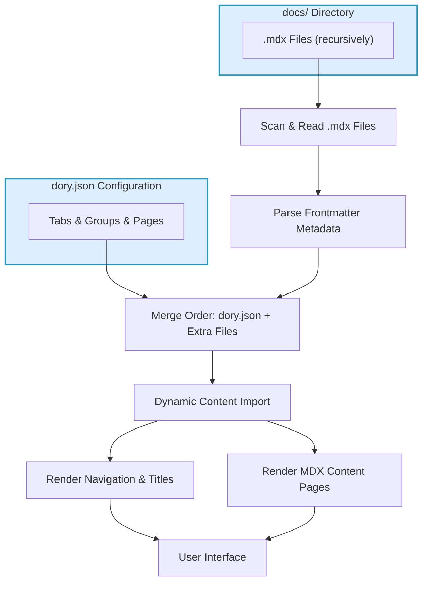

# Add & Structure Documentation Content

This guide shows you how to add your documentation content to your Dory project, structure it properly using `.mdx` files inside the `docs` directory, and understand how Dory automatically detects, orders, and renders your documentation.

---

## 1. Understanding the `docs` Directory

Dory uses the `docs` directory as the root folder to locate your documentation content. Here’s what you need to know:

- Place all your `.mdx` files inside the `docs` directory or its nested folders.
- The structure inside `docs` directly influences your URLs and navigation paths.
- Each `.mdx` file represents a page in your documentation site.

> For example, placing a file at `docs/getting-started/installation.mdx` will map to the path `/getting-started/installation` on your site.

---

## 2. Adding `.mdx` Files

### Step-by-Step

1. **Create or copy your `.mdx` files** into the `docs` directory.

2. **Organize files into folders** if you want to create nested paths and sections.

3. **Use `index.mdx` files** within folders to represent the folder’s root page.

   - For example, `docs/guides/index.mdx` becomes `/guides/` URL.

4. Make sure your `.mdx` files start with frontmatter metadata for page titles and descriptions:

```mdx
---
title: "Installation Guide"
description: "Step-by-step installation instructions for Dory."
---

# Installation Guide

Your content goes here...
```

### Best Practices

- Use clear, descriptive titles in frontmatter.
- Keep file names URL-friendly using kebab-case (e.g., `getting-started.mdx`).
- Use meaningful folder names to reflect your content hierarchy.

---

## 3. How Dory Detects and Renders Content

Dory automatically:

- **Scans `docs/` recursively** to find all `.mdx` files.
- Parses the frontmatter metadata inside each `.mdx` file.
- Maps files to site URLs by converting file paths to URL paths (removes `.mdx`, normalizes index files to slash `/`).
- Loads content dynamically, providing fast navigation and rendering.

### Navigation Order

- The file order and grouping displayed on your site are controlled primarily by the `dory.json` configuration file in your project.
- Navigation uses your `dory.json` tabs, groups, and pages structure to prioritize and sequence pages.
- Any `.mdx` files not explicitly listed in `dory.json` will still be detected and included at the end, sorted alphabetically.

---

## 4. Organizing Your Documentation Content

### Structuring with Folders

- Use folders inside `docs/` to logically group related pages (e.g., `docs/api/`, `docs/guides/`).
- Place an `index.mdx` inside a folder to define the landing page for that section.

### Frontmatter Metadata

- Always include `title` and optionally `description` frontmatter for better SEO and navigation labels.
- Additional frontmatter is also supported and can integrate with features (like linking to OpenAPI or AsyncAPI specs).

### Naming and Paths

| File or Folder Path           | Site URL Path           |
| ---------------------------- | ---------------------- |
| `docs/index.mdx`              | `/`                    |
| `docs/quickstart.mdx`         | `/quickstart`           |
| `docs/api/index.mdx`          | `/api/`                 |
| `docs/api/authentication.mdx` | `/api/authentication`   |

---

## 5. Frontmatter and Navigation Synchronization

Dory uses your frontmatter titles within pages and will update navigation titles dynamically:

- Navigation item titles come from your frontmatter `title` automatically if present.
- If no frontmatter title is found, filenames (converted to readable text) will be used.
- To ensure navigation order and groups, configure your `dory.json` appropriately following the [Configure Dory guide](/getting-started/project-setup/configure-dory).

---

## 6. Example: Adding a New Section with Multiple Pages

1. Inside `docs/`, create a new folder called `tutorials`

2. Add an `index.mdx` file in `docs/tutorials/` with frontmatter:

```mdx
---
title: "Tutorials"
description: "Step-by-step tutorials to get you started."
---

# Tutorials

Welcome to tutorials.
```

3. Add tutorials pages, e.g., `getting-started.mdx` and `advanced-topics.mdx`:

```mdx
---
title: "Getting Started"
---

Content for getting started tutorial.
```

```mdx
---
title: "Advanced Topics"
---

Deep dive content here.
```

4. Update your `dory.json` navigation to include the new group and pages under a tab.

---

## 7. Troubleshooting Common Issues

<AccordionGroup title="Troubleshooting Common Issues">
<Accordion title="My `.mdx` file is not showing up in navigation">
Ensure the file or folder is properly listed in your `dory.json` navigation under a tab and group.
If it is outside navigation, it will appear alphabetically at the end.
Check that frontmatter titles are set correctly.
</Accordion>

<Accordion title="URLs don't match my file paths">
Dory normalizes paths, converting `index.mdx` files to folder roots. For example, `docs/api/index.mdx` maps to `/api/`.
Avoid file names or folders with uppercase or spaces to prevent URL inconsistencies.
</Accordion>

<Accordion title="Frontmatter metadata not updating navigation titles">
Make sure your frontmatter includes a `title` with proper indentation and format:

```yaml
---
title: "My Page Title"
---
```

If you update frontmatter, restart the dev server or rebuild the site to reflect changes.
</Accordion>
</AccordionGroup>

---

## 8. Additional Resources

- [Configure Dory with `dory.json`](https://docs.yoursite.com/getting-started/project-setup/configure-dory) — for controlling navigation and page ordering
- [Authoring Documentation in MDX](https://docs.yoursite.com/guides/getting-started/write-mdx-content) — to learn MDX syntax and best practices
- [Run the Development Server](https://docs.yoursite.com/getting-started/first-run-validation/start-development-server) — to preview your docs live

---

## Summary

Adding and structuring your documentation content with Dory revolves around placing `.mdx` files inside the `docs` folder, organizing them via folders to create URL paths, and controlling order through your site's `dory.json`. Frontmatter metadata provides important titles and descriptions used for navigation labels and SEO. Dory automatically detects all content, blends configured navigation with detected files, and renders everything into a fast, portable documentation site.

<Tip>
Always maintain a clear, logical folder and file structure inside `docs` to ensure consistent URL paths and intuitive navigation.
</Tip>


---

## Example Frontmatter JSON Generation

Dory leverages a background process that reads all `.mdx` files and merges their frontmatter metadata in the order defined by `dory.json` navigation tabs, groups, and pages. This order defines the navigation menu while including any extra documentation pages in alphabetical order.

This automation saves you from manually syncing navigation with physical files continually.

---

## Previewing Content

After adding or modifying `.mdx` files, always run:

```bash
pnpm run dev
```

to start the local development server and preview live changes.

---

## Key Tips

- Use consistent kebab-case file and folder names.
- Always include frontmatter titles.
- Place `index.mdx` files to define section root pages.
- Keep your `dory.json` navigation updated for best navigation control.
- Use the development server’s hot reload to catch issues early.


---

<Check>
You have successfully configured and structured your documentation content to be recognized and rendered by Dory.
</Check>


## See Also

- [Initialize Your Documentation Project](https://docs.yoursite.com/getting-started/project-setup/create-project)
- [Configure Dory (dory.json)](https://docs.yoursite.com/getting-started/project-setup/configure-dory)
- [Run the Development Server](https://docs.yoursite.com/getting-started/first-run-validation/start-development-server)

---

# Additional Diagram: Content Detection and Rendering Flow



---

This diagram visualizes how Dory processes your `.mdx` documentation files combined with your `dory.json` navigation settings to deliver your documentation site.


---