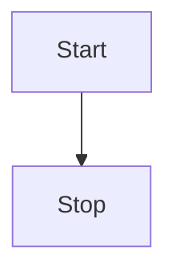

# Embedding Live Code and Dynamic Examples

Discover how to enhance your Dory documentation with live, interactive code blocks and dynamic example sections using built-in MDX components. This guide walks you through using fenced code blocks, code groups, and playground components to showcase runnable code and API testing capabilities that engage and empower your readers.

---

## 1. Overview

### What You Will Learn
- How to embed syntax-highlighted, live code snippets that can be grouped or toggled
- How to leverage dynamic API playgrounds for HTTP and WebSocket within your docs
- How built-in MDX components improve interactivity and clarity in technical documentation

### Prerequisites
- Basic familiarity with MDX syntax and component usage in Dory
- A Dory project set up with the development server running

### Expected Outcome
By following this guide, you will be able to add rich, interactive code examples and API playgrounds directly into your documentation pages, allowing users to read, understand, and test code or APIs without leaving the docs.

### Time Estimate
10-20 minutes for initial integration, depending on the number of examples added.

### Difficulty Level
Intermediate (some experience authoring MDX-based docs and configuring Dory)

---

## 2. Using Fenced Code Blocks for Static and Live Code

Dory supports fenced code blocks with built-in syntax highlighting and theming. You can embed language-specific code blocks simply using triple backticks and the language name.

### Basic Syntax
```mdx
```typescript
function greet() {
  return 'Hello World';
}
```
```

### How It Works
- The `<Fence>` component automatically detects the code language and applies Prism-based highlighting.
- Dark mode is supported automatically using the theme matching your site’s current color mode.
- Mermaid diagrams are supported by specifying `mermaid` as the language.

### Example:
```mdx

```

### Best Practices
- Choose descriptive code block titles where applicable.
- Use fenced blocks for short to medium examples.
- For multiple code versions or languages, use Code Groups (see next section).

---

## 3. Grouping Code Examples with Code Groups

To present multiple code snippets as tabs for easy language switching, use the `<CodeGroup>` component.

### How to Use
Wrap your individual fenced code blocks inside a `<CodeGroup>` block.

### Example Usage
```mdx
<CodeGroup>
```typescript
function example(): string {
  return 'Hello TypeScript';
}
```

```javascript
function example() {
  return 'Hello JavaScript';
}
```
</CodeGroup>
```

### Benefits
- Users can toggle between different programming languages or variations.
- Neatly organized interface increases reader engagement and accessibility.

---

## 4. Embedding the HTTP API Playground

Dory includes an interactive `APIPlayground` component that lets you embed real HTTP API testing interfaces directly in your documentation.

### Key Features
- Supports all major HTTP methods like GET, POST, PUT, PATCH, DELETE.
- Configure query parameters, headers, body, and authentication (Bearer, API Key, Basic).
- Displays live response status, time, headers, and formatted JSON.
- Provides error messages and loading states for clear user feedback.

### How to Add
Insert the `<APIPlayground>` component in your MDX with props to specify the endpoint and details.

### Minimal Example
```mdx
<APIPlayground
  method="GET"
  url="/api/users"
  title="Get Users"
  description="Retrieve a list of users with optional filters"
  parameters={[
    {
      name: 'page',
      type: 'number',
      description: 'Page number for pagination',
      defaultValue: '1'
    }
  ]}
  authType="bearer"
  servers={[{url: 'https://api.example.com', description: 'Production API'}]}
/>
```

### User Flow
- Readers configure parameters and headers, authenticate if needed.
- Click 'Send Request' to fetch live data from the API.
- View detailed response data and headers within the same page.

---

## 5. Embedding WebSocket Playground for Real-Time APIs

Use the `<WebSocketPlayground>` component to provide a live, configurable WebSocket client interface.

### Features
- Connect/disconnect buttons with connection status indicators.
- Configure headers, subprotocols, and various auth methods.
- Send and receive messages with a live message log.
- Supports binary and text messages.

### How to Use
Add the component to your MDX content with the WebSocket URL and optional configurations.

### Example
```mdx
<WebSocketPlayground
  url="/ws/chat"
  title="Basic Chat WebSocket"
  description="Connect and send messages in real-time"
  servers={[
    { url: 'wss://echo.websocket.org', description: 'Echo Server' },
    { url: 'wss://example.com/chat', description: 'Production Chat' }
  ]}
  subprotocols={["chat", "v1.0"]}
  authType="bearer"
  headers={{"X-Custom-Header": "value"}}
/>
```

### Reader Interaction
- Choose a server from the dropdown.
- Connect to the WebSocket.
- Send messages using the input box.
- View sent and received messages in the history log.

---

## 6. Auto Wrapping for Standalone Code Blocks

When authoring MDX, standalone fenced code blocks outside of a `<CodeGroup>` are automatically wrapped in one unless the language is `mermaid`.

This means simply writing a fenced block will yield a nicely styled, grouped code block interface by default without extra markup.

---

## 7. Tips & Best Practices

- Use meaningful titles and descriptions with interactive playgrounds to guide users.
- For API playgrounds, keep your base URLs and endpoints correct to ensure working requests.
- Verify authentication settings to avoid user confusion or errors.
- For complex code examples, break them into logical steps using `<Steps>` or expandable sections.
- Use color themes and dark mode testing to ensure readability.

---

## 8. Troubleshooting

<AccordionGroup title="Common Issues & Solutions">
<Accordion title="Syntax Highlighting Not Appearing">
Make sure the fenced code block language name is one supported by Prism; check supported languages if unsure. Confirm you are not missing the closing backticks.
</Accordion>

<Accordion title="API Playground Fails to Send Requests">
Verify your endpoint URLs and CORS settings. Ensure your development server or deployment environment supports fetch requests to the API. Check console for errors.
</Accordion>

<Accordion title="WebSocket Connection Errors">
Confirm the WebSocket URL and protocol are correct. Check authentication tokens or headers. Be aware of browser security settings and network restrictions.
</Accordion>
</AccordionGroup>

---

## 9. Next Steps & Related Documentation

- Explore [Authoring Documentation in MDX](/guides/getting-started/write-mdx-content) to deepen your understanding of MDX authoring.
- Review the [OpenAPI Integration Guide](/guides/api-and-interactive-guides/openapi-integration) to automatically generate API reference pages with playgrounds.
- Learn about collaboration best practices in [Collaborative Authoring](/guides/customization-and-best-practices/collaborative-authoring).
- See live examples in demos: [API Playground Demo](docs/api-playground-demo.mdx) and [WebSocket Playground Demo](docs/websocket-playground-demo.mdx).

---

## 10. References

- [Fence Component Source Code](https://github.com/clidey/dory/blob/main/src/mdx/fence.tsx)
- [API Playground Source](https://github.com/clidey/dory/blob/main/src/mdx/api-playground.tsx)
- [WebSocket Playground Source](https://github.com/clidey/dory/blob/main/src/mdx/websocket-playground.tsx)

<Tip>
Embedding live code and interactive examples in your technical documentation turns passive reading into active learning. Utilize Dory's components to make your docs a powerful hub for understanding and testing APIs and code.
</Tip>
