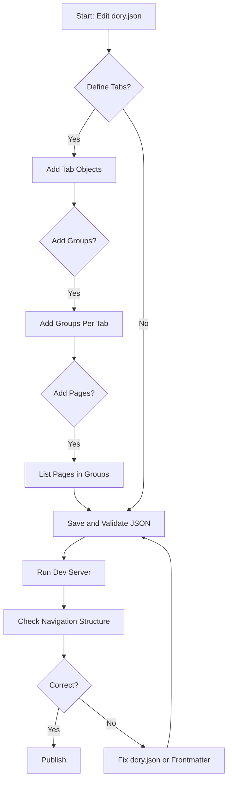

# Organize Pages and Navigation with dory.json

Welcome to the guide on organizing your documentation site's navigation and page structure using `dory.json`. This documentation walks you through how to define sections, order pages, and customize the visible site structure so your users can find content quickly and intuitively.

---

## 1. Understanding dory.json and Its Role

Your Dory-powered site uses `dory.json` as the central configuration file to map out the navigation experience. Instead of relying solely on automatic file discovery, this JSON file defines the exact order and grouping of tabs, navigation groups, and pages.

Think of `dory.json` as your site's sitemap blueprint, empowering you to:

- Create **top-level tabs** for major content areas.
- Organize pages into **groups** that form subsections inside each tab.
- Explicitly order pages to control sequence and priority.

This approach results in a clean, user-friendly navigation experience tailored to your documentation structure.

---

## 2. Prerequisites

Before you start editing or creating `dory.json`, ensure the following:

- You have a working Dory project with the `docs/` directory containing your `.mdx` documentation files.
- The base configuration exists; typically, `dory.json` is at the root or inside the main `docs/` directory.
- Familiarity with JSON syntax since you'll be editing this file directly.
- Your pages have frontmatter metadata defining titles and descriptions to supplement navigation labels.

---

## 3. How to Structure dory.json

Here's the basic anatomy of `dory.json`, highlighting the three hierarchical navigation levels:

### The main elements:

- **Tabs** (`tabs`) — Highest-level sections represented in the top navigation bar.
- **Groups** (`groups`) — Subsections inside tabs that group related pages.
- **Pages** (`pages`) — The actual documentation content files shown inside groups.

### Core structure example:

```json
{
  "navigation": {
    "tabs": [
      {
        "tab": "Getting Started",
        "groups": [
          {
            "group": "Project Setup",
            "pages": [
              "create-project",
              "configure-dory",
              "add-docs"
            ]
          },
          {
            "group": "First Run",
            "pages": [
              "start-development-server",
              "build-static-site"
            ]
          }
        ]
      },
      {
        "tab": "Guides",
        "groups": [
          {
            "group": "Getting Started",
            "pages": [
              "quickstart-workflow",
              "organize-structure",
              "write-mdx-content"
            ]
          }
          // More groups...
        ]
      }
      // More tabs...
    ]
  }
}
```

> The `pages` keys reference the filenames of your `.mdx` files **without** extensions or folders unless nested explicitly.

---

## 4. Creating and Editing Tabs

Tabs represent the broadest level of your documentation site navigation, like chapters in a book.

### To add a new tab:

1. Open `dory.json` in your project root or designated config folder.
2. In the `navigation.tabs` array, create a new object with a unique `tab` name.
3. Add one or more `groups` inside the tab.

Example:

```json
{
  "tab": "API Reference",
  "groups": [
    {
      "group": "REST API",
      "pages": ["rest-authentication", "rest-endpoints"]
    },
    {
      "group": "WebSocket APIs",
      "pages": ["ws-auth", "ws-channels"]
    }
  ]
}
```

---

## 5. Defining Groups Within Tabs

Groups divide a tab into smaller thematic chunks, helping users focus on related topics.

### How to define groups:

- Each group must have a `group` title string.
- Under `pages`, list file slugs exactly matching your `.mdx` files (without `.mdx`).
- Groups appear as headings or expandable sections in the side navigation.

### Good practice:

- Group pages logically (e.g., "Authentication", "Errors", "Examples").
- Keep groups focused to avoid overwhelming users.

---

## 6. Ordering Pages

Page order inside each group determines the navigation sequence and sidebar listing.

### Ordering steps:

- List pages in the `pages` array in the preferred reading sequence.
- If you want to reorder later, just rearrange the array.

Example snippet:

```json
"pages": ["overview", "installation", "configuration", "usage"]
```

### Important:

- Page filenames must correspond to your `.mdx` files in the `docs` directory structure.
- Ensure page slugs are correct, ignoring extensions and folder names unless nested.

---

## 7. Synchronizing Page Metadata with Navigation

Dory uses page frontmatter metadata (`title`, `description`) to enhance navigation.

### How it works:

- The `dory.json` page slug is linked to the `.mdx` file
- The page's frontmatter `title` overrides display names in navigation, making labels human-friendly.
- This allows you to keep short, simple slugs in `dory.json` while showing polished, descriptive titles.

### Example frontmatter:

```mdx
---
title: "Getting Started with Dory"
description: "Step-by-step guide to initialize your project."
---

# Welcome!
```

### Best Practice:

- Always define `title` in each page's frontmatter for consistent navigation labels.
- Keep slugs in `dory.json` stable and update page titles for clarity.

---

## 8. Previewing and Validating Your Navigation

Once modified, verify your site navigation behaves correctly.

### Steps:

1. **Run the development server:**

```bash
pnpm run dev
```

2. **Navigate through tabs, groups, and pages:**
- Confirm that the top tabs match your `dory.json` `tab` names.
- Groups under each tab appear as subsections.
- Pages listed under each group follow your defined order.

3. **Check page titles:**
- Navigation labels should reflect the page frontmatter titles.
- Missing or wrong titles will fall back to slug names.

4. **Troubleshoot:**
- Verify JSON syntax in `dory.json`.
- Ensure page slugs match `.mdx` filenames.
- Confirm frontmatter exists and is correctly formatted.

<Tip>
To avoid navigation surprises, keep your `dory.json` and `.mdx` filenames synchronized carefully, especially when renaming or moving files.
</Tip>

---

## 9. Advanced Customization Tips

### Hide or Show Navigation Elements

- Pages not referenced in `dory.json` won’t appear in navigation, enabling you to create hidden or auxiliary docs.

### Nested Folder Structures

- Use simple slugs only in `pages` but organize `.mdx` files in folders.
- The slug must reflect the filename, not the folder path.

### Dynamic Navigation

- Combine with frontmatter to dynamically override titles and descriptions.

### Use Consistent Naming

- For easier maintenance, follow kebab-case or snake_case for file and slug names.

---

## 10. Troubleshooting Common Issues

<AccordionGroup title="Common Problems & Resolutions">
<Accordion title="Navigation Tabs Not Showing or Empty">

- Verify that your `dory.json` `tabs` array is properly defined and not empty.
- Confirm your JSON syntax with a validator.
- Make sure the development server is restarted after changes.

</Accordion>
<Accordion title="Pages Not Found in Navigation or 404s">

- Confirm your `.mdx` filenames correspond exactly to the `pages` slugs.
- Check that files are in the correct `docs` directory.
- Ensure page frontmatter `title` exists to avoid fallback display issues.

</Accordion>
<Accordion title="Incorrect Page Order">

- Confirm the order of page slugs in the `pages` array.
- Ensure there are no duplicate filenames or conflicting slugs.

</Accordion>
<Accordion title="Frontmatter Titles Not Appearing">

- Make sure frontmatter is at the very top of `.mdx` files.
- Validate YAML format strictly.
- Restart dev server if changes don't reflect.

</Accordion>
</AccordionGroup>

---

## 11. Example of a Complete dory.json

```json
{
  "navigation": {
    "tabs": [
      {
        "tab": "Getting Started",
        "groups": [
          {
            "group": "Project Setup",
            "pages": [
              "create-project",
              "configure-dory",
              "add-docs"
            ]
          },
          {
            "group": "First Run",
            "pages": [
              "start-development-server",
              "build-static-site",
              "troubleshooting-common-issues",
              "validate-quickly"
            ]
          }
        ]
      },
      {
        "tab": "Guides",
        "groups": [
          {
            "group": "Getting Started",
            "pages": [
              "quickstart-workflow",
              "organize-structure",
              "write-mdx-content"
            ]
          },
          {
            "group": "Customization & Best Practices",
            "pages": [
              "custom-theme-tailwind",
              "collaborative-authoring",
              "performance-and-deployment"
            ]
          }
        ]
      },
      {
        "tab": "API Reference",
        "groups": [
          {
            "group": "REST API",
            "pages": [
              "rest-authentication",
              "rest-endpoints",
              "rest-errors-status",
              "rest-examples-sdks"
            ]
          },
          {
            "group": "WebSocket & Async API",
            "pages": [
              "ws-auth",
              "ws-channels",
              "ws-playground"
            ]
          }
        ]
      }
    ]
  }
}
```

---

## 12. Visual Overview of Navigation Flow



---

## 13. Next Steps

- Dive deeper into **[Configuring Dory with dory.json](/getting-started/project-setup/configure-dory)** for more advanced options.
- Learn how to **[Add and Structure Documentation Content](/getting-started/project-setup/add-docs)** to complement your navigation.
- After organizing, proceed to **[Running Development Server](/getting-started/first-run-validation/start-development-server)** to preview changes live.
- Explore **[Authoring Documentation in MDX](/guides/getting-started/write-mdx-content)** for richer content creation.

---

## 14. Additional Resources

- Official GitHub Repository: [https://github.com/clidey/dory](https://github.com/clidey/dory)
- Full Docs Navigation Reference: Available in your project under `dory.json`
- Troubleshooting Guide: [Troubleshooting Common Issues](/getting-started/first-run-validation/troubleshooting-common-issues)


---

<Check>
You have now structured your documentation site navigation confidently and can deliver an intuitive experience to your users.
</Check>

---

Continue building great docs with Dory!