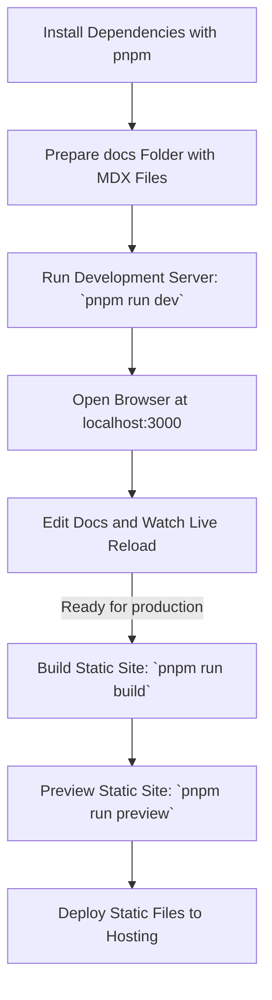

# Create and Preview Your First Documentation Site

Welcome to your first hands-on guide for getting started with Dory. This tutorial walks you through setting up a fresh Dory documentation site from scratch — from installing dependencies to creating your docs folder and previewing your content in real-time.

Whether you've never spun up a static site before or you're eager to experience Dory's blazing-fast development feedback loop, this guide is your reliable companion.

---

## What You'll Achieve

By following this guide, you will:

- Install all necessary dependencies to run Dory locally
- Prepare and organize your documentation source files in the expected folder
- Start the local development server and see your documentation live
- Make edits and observe instant changes thanks to hot reloading

---

## Prerequisites

Before you begin, ensure you have the following installed and ready:

- **Node.js** (version 16 or higher)
- **pnpm** package manager (recommended for installing dependencies)
- Basic familiarity with your terminal/command prompt
- Some existing Markdown or MDX documentation files ready to use or create new ones

If you need help installing Node.js or pnpm, please refer to the [System Requirements](../../getting-started/prerequisites-installation/system-requirements) and [Installing the CLI](../../getting-started/prerequisites-installation/install-cli) guides.

---

## Estimated Time

About 15-30 minutes, depending on your familiarity with the command line and if you have existing docs ready.

---

## Step-by-Step Workflow

<Steps>
<Step title="Clone or Initialize Your Documentation Project">
Start by cloning an existing Dory documentation repository or set up your project workspace. If you're starting fresh, create a folder where your docs will live.

```bash
# Example: clone the official Dory repository
git clone https://github.com/clidey/dory.git
cd dory
```

If setting up your own project, just ensure you will have a folder named `docs` for documentation files.

<Check>Your current directory contains a `docs` folder with your Markdown/MDX files.</Check>
</Step>

<Step title="Install Dependencies Using pnpm">
In the root of your project, run:

```bash
pnpm install
```

This installs all necessary packages, including Dory and its development tools.

<Tip>If you don’t have `pnpm` installed, install it globally with:

```bash
npm install -g pnpm
```
</Tip>

<Check>Ensure the `node_modules` folder and `pnpm-lock.yaml` file are present afterward.</Check>
</Step>

<Step title="Prepare Your Documentation Folder">
Make sure your documentation source files (.mdx or .md) are inside the `docs` folder at the root.

```bash
# If you have docs elsewhere, copy them in
cp -r ../your-docs-source/* ./docs/
```

The `docs` directory is where Dory looks for content to build and serve.

<Warning>Do not rename or move the `docs` folder unless you update your config accordingly.</Warning>

<Check>Your `docs` folder contains your documentation structure with frontmatter metadata.
</Check>
</Step>

<Step title="Run the Development Server and Preview Your Site">
Start the live development server to preview your documentation in real-time:

```bash
pnpm run dev
```

After it starts, open your browser and navigate to `http://localhost:3000`. Your documentation site loads, displaying your pages with Dory’s clean layout.

<Tip>Modify any `.mdx` or `.md` file inside `docs/` and save to see instant updates without refreshing.</Tip>

<Check>Verify pages render as expected, and the sidebar navigation reflects your doc structure.</Check>
</Step>

<Step title="(Optional) Build a Static Site for Production">
When ready to deploy your site, run:

```bash
pnpm run build
```

This generates a static `dist` folder with your fully built site.

To preview the built site locally:

```bash
pnpm run preview
```

Open the URL shown (usually http://localhost:4173) to experience your static build.

<Check>Static build contains optimized assets and your documentation content.</Check>
</Step>
</Steps>

---

## Practical Tips & Best Practices

- **Keep your docs organized:** Use folders and proper frontmatter in `.mdx` files to structure navigation cleanly.
- **Leverage hot reload:** During development, make frequent saves. Dory updates instantly.
- **Watch out for port conflicts:** If `localhost:3000` is busy, kill the other process or reconfigure.
- **Use descriptive frontmatter:** Titles, descriptions, and navigation hints improve site usability.
- **Validate navigation config:** Double-check `dory.json` for correct paths (see guides on configuring navigation).

---

## Troubleshooting Common Issues

<AccordionGroup title="Common Setup Issues">
<Accordion title="Development server doesn't start or crashes">
- Check that Node.js and pnpm versions meet requirements.
- Ensure no other programs block port 3000.
- Delete `node_modules` and `pnpm-lock.yaml` and reinstall.
- Check console for error details and search known issues.
</Accordion>

<Accordion title="Docs folder not found or pages missing">
- Confirm your documentation files are inside the `docs` folder.
- Ensure filenames use `.mdx` or `.md` extensions.
- Validate frontmatter and file naming conventions.
- Restart the dev server after adding new pages.
</Accordion>

<Accordion title="Live updates not appearing in browser">
- Confirm the dev server is running.
- Clear browser cache or try an incognito window.
- Verify file watchers are running correctly (especially on network drives).
</Accordion>
</AccordionGroup>

---

## Visual Overview of User Workflow



---

## What’s Next?

Now that your local documentation site is up and running, explore these next guides to deepen your mastery:

- [Organize Pages and Navigation with dory.json](../../guides/getting-started/organize-structure): Structure the navigation menu and control page order.
- [Authoring Documentation in MDX](../../guides/getting-started/write-mdx-content): Learn to write rich, interactive docs using MDX.
- [Configure Dory (dory.json)](../../getting-started/project-setup/configure-dory): Customize site-wide settings and behavior.
- [Build and Serve the Static Site](../../getting-started/first-run-validation/build-static-site): Understand production builds and deployment.

Feel confident experimenting and building documentation your team and users will love!

---

## References

- [CLI Installation Guide](../../getting-started/prerequisites-installation/install-cli)
- [System Requirements](../../getting-started/prerequisites-installation/system-requirements)
- [Development Server Guide](../../getting-started/first-run-validation/start-development-server)
- [Troubleshooting Common Setup Issues](../../getting-started/first-run-validation/troubleshooting-common-issues)

---

If you encounter issues or want to extend your docs features, visit our community repository and discussion channels.

Happy documenting with Dory! 🐟