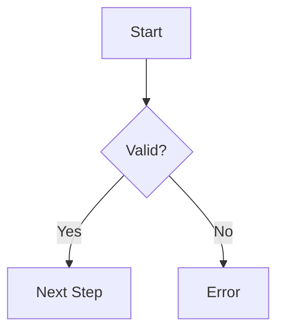

# Authoring Documentation in MDX

## Unlock the Power of MDX in Dory

Welcome to the practical guide for authoring documentation with Dory's native support for MDX — a powerful blend of Markdown and JSX. This page empowers you to write rich, interactive, and well-structured docs using Markdown syntax while seamlessly embedding React-like components and live interactive elements.

By mastering this page, you can create dynamic and engaging technical documentation that leverages Dory's built-in components, making your docs more expressive and easier to navigate.

---

## 1. What is MDX in Dory?

MDX lets you use regular Markdown alongside JSX components inside `.mdx` files, enabling rich documentation experiences. In Dory, you write your docs in `.mdx` files placed inside the `/docs` folder, combining:

- **Markdown** for text formatting (headings, lists, tables, etc.)
- **JSX Components** to embed interactive UI components like code blocks, accordions, callouts, diagram renderers, and more

This hybrid approach keeps your docs simple and readable while unlocking the power of React-like interactive features without extra setup.

---

## 2. Prerequisites

Before you start authoring docs with MDX in Dory, make sure:

- Your project is set up with Dory's recommended directory structure, specifically having a `/docs` folder
- You have a working development server running `pnpm run dev` (see [Run the Development Server](/getting-started/first-run-validation/start-development-server))
- You understand the basics of Markdown syntax
- Familiarity with JSX or React components helps but is not required

---

## 3. Authoring Workflow: Writing MDX Content

### Step 1: Create and Place Your MDX File

- Create a new `.mdx` file inside the `/docs` folder (e.g., `getting-started.mdx`)
- Use normal Markdown syntax for paragraphs, headings, lists, tables, images

Example:

```mdx
# Getting Started
Welcome to the documentation for getting started with Dory.

- Install
- Configure
- Run
```


### Step 2: Use Built-in MDX Components to Enrich Your Content

Dory provides a rich set of built-in React-like components usable inside your MDX content. You can import them implicitly and use them directly.

#### Commonly Used Components Include:

- `<Code>` and `<CodeGroup>`: Display syntax-highlighted single or grouped code blocks
- `<Accordion>` and `<AccordionGroup>`: Organize content inside expandable sections
- Callouts (`<Note>`, `<Tip>`, `<Warning>`, `<Info>`, `<Check>`): To highlight important information or warnings
- `<Card>` and `<CardGroup>`: Show cards with optional icons and titles
- `<Steps>` and `<Step>`: Present sequential workflows or instructions
- `<Mermaid>` blocks: Embed live Mermaid diagrams inside code blocks

Example embedding a code block:

```mdx
<CodeGroup title="Example Code in TypeScript and JavaScript">
```typescript
function sayHello(): string {
  return 'Hello World';
}
```
```javascript
function sayHello() {
  return 'Hello World';
}
```
</CodeGroup>
```

### Step 3: Combining Markdown and JSX

MDX allows you to switch between Markdown syntax and JSX seamlessly. For example, between paragraphs, you can embed a callout:

```mdx
Here is some introductory text.

<Tip>
Remember to restart your dev server after adding new MDX files.
</Tip>

Continue with more text here.
```

### Step 4: Use Frontmatter for Page Metadata

Each MDX file can include YAML frontmatter at the top to set page title, description, and other meta-information.

Example:

```mdx
---
title: 'Getting Started with Dory'
description: 'Quick guide to installing and running Dory'
---

# Getting Started
Your guide content starts here.
```

This metadata integrates with the navigation system and SEO meta tags.

---

## 4. Essential MDX Components in Detail

### 4.1 Code and CodeGroup

Leverage the `<Code>` component for inline or block code snippets with language syntax highlighting and copy-to-clipboard buttons.

Use `<CodeGroup>` when you want to show multiple related code blocks side by side with tab selection.

Example:

```mdx
<Code language="typescript">
const message = 'Hello World';
console.log(message);
</Code>

<CodeGroup title="Multiple Language Examples">
```typescript
// TypeScript example
function greet(name: string) {
  return `Hello, ${name}`;
}
```
```javascript
// JavaScript example
function greet(name) {
  return `Hello, ${name}`;
}
```
</CodeGroup>
```

### 4.2 Callouts

Use callout components to highlight or warn users:

- `<Note>`: General notes or info
- `<Tip>`: Helpful tips
- `<Warning>`: Critical warnings
- `<Info>`: Additional informational boxes
- `<Check>`: Completed steps or confirmations

Example:

```mdx
<Warning>
Make sure to back up your docs before upgrading.
</Warning>
```

### 4.3 Accordion & AccordionGroup

Perfect for FAQ or collapsible content sections.

```mdx
<AccordionGroup title="FAQs">
  <Accordion title="What is Dory?">
    Dory is a lightweight static site generator for docs.
  </Accordion>
  <Accordion title="How to install?">
    Follow the CLI installation guide.
  </Accordion>
</AccordionGroup>
```

### 4.4 Mermaid Diagrams

Embed diagrams directly inside Markdown code blocks with `mermaid` as the language:

```mdx

```

This renders dynamic diagrams aiding visual explanations.

### 4.5 Steps & Step

Ideal for listing instructions or workflows step-by-step.

Example:

```mdx
<Steps>
  <Step title="Install Dory">
  Run `pnpm install` in your project.
  </Step>
  <Step title="Run Dev Server">
  Use `pnpm run dev` to see live updates.
  </Step>
</Steps>
```

### 4.6 Cards and CardGroup

Create visually distinct cards for linking other pages or highlighting features.

```mdx
<CardGroup cols={2}>
  <Card title="Guide: Getting Started" icon="FileText" href="/guides/getting-started/quickstart-workflow" />
  <Card title="API Reference" icon="Code" href="/api-reference/rest-api/rest-authentication" />
</CardGroup>
```

---

## 5. Tips for Authoring Effective MDX Documentation

- **Keep Markdown structural:** Use headings and lists to organize content hierarchically
- **Use callouts strategically:** Highlight important info to catch user attention
- **Leverage interactive components:** Code groups, accordions, and steps improve readability and engagement
- **Write meaningful frontmatter:** Ensure titles and descriptions are clear to enhance SEO and navigation
- **Test live:** Run the dev server and verify your MDX content renders as expected

<Tip>
To speed up your workflow, take advantage of hot-reloading — see your MDX changes live without refreshing manually.
</Tip>

---

## 6. Common Pitfalls and Troubleshooting

### Problem: MDX content not rendering custom components
- Ensure your components are correctly imported or, in Dory's case, use the built-in MDX components directly without import
- Confirm your MDX file has `.mdx` extension
- Check the development server console for errors

### Problem: Callout or Accordion not appearing as expected
- Verify the JSX tags are correctly closed
- Avoid stray HTML inside JSX components

### Problem: Mermaid diagrams not displaying
- Ensure the code block is labeled exactly with `mermaid`
- Follow the Mermaid.js syntax

### Problem: Page titles not showing correctly in navigation
- Include `title` in frontmatter at the top of your MDX file
- Restart dev server or reload to see updated frontmatter

---

## 7. Advanced Authoring Scenarios

### Embedding API Playground
You can embed interactive OpenAPI or AsyncAPI playgrounds using `<APIPlayground>` or `<WebSocketPlayground>` components inside your MDX content, perfect for live API demonstrations.

### Using Source Component
Display code file snippets with `<Source>` to link live source files for easier developer reference.

Example:

```mdx
<Source url="https://github.com/clidey/dory" paths={[{ path: "src/mdx/code.tsx", range: "10-50" }]} />
```

---

## 8. Next Steps & Related Documentation

Once comfortable with basic MDX authoring, explore:

- [Organizing Pages and Navigation with dory.json](/guides/getting-started/organize-structure): Structuring your docs for easy navigation
- [Embedding Live Code and Dynamic Examples](/guides/api-and-interactive-guides/live-code-examples): Enhancing docs with live interactive code
- [Customizing Design with Tailwind & Theme Overrides](/guides/customization-and-best-practices/custom-theme-tailwind): Styling your docs
- [Run the Development Server](/getting-started/first-run-validation/start-development-server): For live preview and iteration

Refer to the full [Features Overview](/overview/feature-overview/features-at-a-glance) for a complete list of Dory's MDX components and capabilities.

---

## Summary

This guide makes MDX authoring approachable and practical within Dory:

- Write Markdown and embed JSX components together seamlessly
- Use built-in interactive components to enrich your docs
- Manage page metadata with frontmatter
- Follow best practices and avoid common pitfalls
- Preview instantly with the dev server

Experiment, iterate, and deliver professional-grade documentation effortlessly using MDX in Dory.

---

<Source url="https://github.com/clidey/dory" paths={[{"path": "docs/guides/getting-started/write-mdx-content.mdx", "range": "1-90"}]} />
