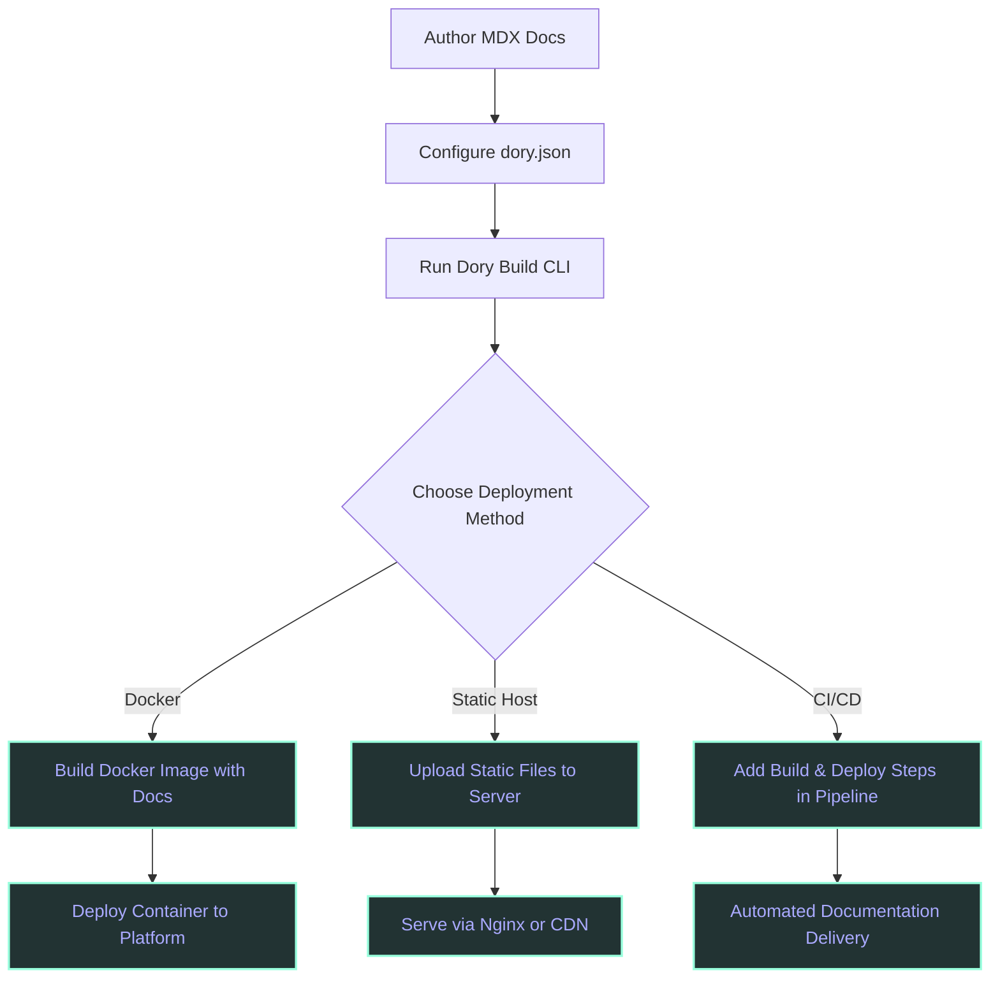

# Integration & Extensibility Overview

Discover how Dory fits seamlessly into your existing technical documentation workflows. This page highlights Dory's strengths in portability, easy configuration, and smooth integration with popular deployment and CI/CD pipelines, enabling you to leverage Dory wherever you document.

---

## Why Integration & Extensibility Matter

In today’s fast-paced development environments, flexibility and portability are paramount. Dory is designed to empower you to embed your documentation easily into any workflow and infrastructure without getting locked into complex setups or proprietary formats. Whether you want to deploy your docs on Docker, serve static assets with Nginx, or automate publishing through CI/CD pipelines, Dory makes it straightforward.

Imagine building your documentation once and then deploying it anywhere — on your own servers, cloud platforms, or even as a containerized app. This overview helps you understand exactly how to integrate and extend Dory for maximum value.

---

## Core Integration Capabilities

- **Portability with Static Output:** Dory generates fully static documentation sites. The output consists of pre-rendered HTML, CSS, JavaScript, and assets that can be hosted on virtually any web server — no special backend required.

- **Simple Configuration:** Dory relies on a straightforward JSON configuration file (`dory.json`) to customize build behavior and project settings. This simplicity lets you tailor your docs quickly without diving into complex build scripts.

- **CI/CD Friendly:** Output is static and deterministic, making it ideal for integration with CI/CD pipelines. Automate builds and deployments using common tools like GitHub Actions, GitLab CI, Jenkins, or any pipeline that can run Node.js scripts.

- **Docker & Container Support:** You can encapsulate your Dory build and serve process within Docker images. This containerization enables consistent deployment across machines and cloud platforms, simplifying setup and scaling.

- **Static Hosting Ready:** The exported site can be easily served by static hosting services such as Netlify, Vercel, GitHub Pages, or traditional web servers like Nginx or Apache.

- **Extensible Documentation with MDX & Components:** Leveraging MDX empowers you to extend your docs with React-like components, custom interactive elements, and third-party integrations, enhancing user experience.

---

## How Dory Fits Into Your Workflow

### Typical User Flow

1. **Prepare Documentation Sources:** Author your technical docs using MDX files.
2. **Configure Project:** Define project settings and navigation in `dory.json`.
3. **Build Static Site:** Run the Dory CLI to generate a static site bundle.
4. **Deploy Output:** Choose your deployment method — a Docker container, static file hosting, or integration into existing web infrastructure.
5. **Automate Publishing:** Optionally incorporate build and deploy commands into your CI/CD pipeline for automatic updates on commits.

This flow ensures your documentation remains fast, scalable, and maintainable, with minimal friction.

### Example Deployment Scenarios

- **Docker-Based Workflow:**
  - Package Dory and your docs into a Docker image.
  - Run the container to build and optionally serve the static site.
  - Push the container to a registry and deploy on Kubernetes or Docker Swarm.

- **Static Hosting via Nginx:**
  - Build your docs locally or via CI.
  - Upload static assets to a server with Nginx.
  - Use Nginx to serve the files efficiently with caching and compression.

- **CI/CD Pipeline Integration:**
  - Add Dory build commands as steps in your pipeline.
  - Upon successful build, push the static site to your hosting service.
  - Receive automated updates seamlessly after documentation changes.

---

## Best Practices for Integration

- Maintain your `dory.json` configuration under version control alongside your docs.
- Use Docker containers to avoid environment inconsistencies across developers and deployment.
- Leverage CI/CD pipelines for continuous documentation delivery, ensuring your docs are always up to date.
- Serve your static site with a CDN or performant static server for optimal access speeds worldwide.
- Utilize MDX features to enrich your documentation with interactive components that connect directly to your ecosystem.

---

## Common Pitfalls and Troubleshooting

- **Build Failures:** Ensure Node.js and dependencies match required versions. Check logs for errors related to configuration or invalid MDX syntax.

- **Static Files Not Serving Correctly:** Verify your web server root points to the site output folder. Check permissions and URL routing rules.

- **Docker Container Issues:** Confirm your Dockerfile correctly installs dependencies and exposes the appropriate ports if serving.

- **CI/CD Pipeline Errors:** Confirm build environment has access to all required files and environment variables.

<Tip>
Always test your build and deployment steps locally before integrating into CI/CD pipelines to isolate errors early.
</Tip>

---

## Summary Diagram: Integration Flow

---

## Next Steps

- Review [System Architecture](/overview/architecture-integration/system-architecture) for a detailed understanding of Dory's build and runtime.
- Explore [Technology Stack](/overview/architecture-integration/technology-stack) to see the tools powering Dory.
- Dive into [Getting Started Guides](/getting-started/prerequisites-installation/system-requirements) for hands-on setup instructions.

Discover how to extend Dory’s capabilities with interactive API documentation and live code examples by visiting the Guides tab.

<Info>
For deployment-specific help and examples, consult the Deployment section of the docs.
</Info>
