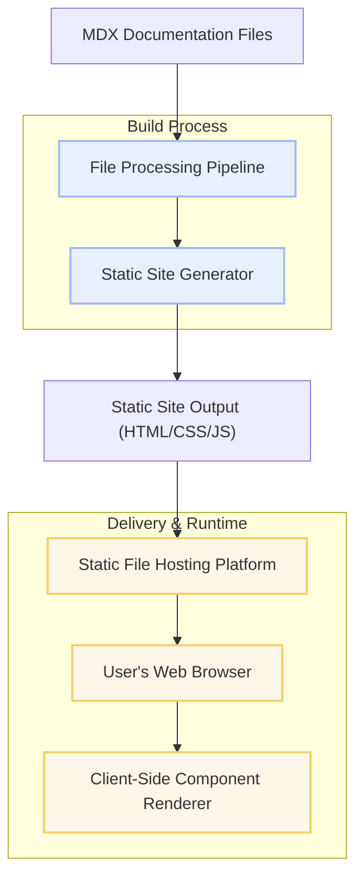

# System Architecture

## Visualizing How Dory Works Behind the Scenes

Understanding Dory’s system architecture is essential to appreciate how its lightweight static site generator effortlessly transforms your documentation content into fast, portable, and beautifully rendered websites. This page offers a clear, narrative overview with a focus on the user journey from writing documentation files to consuming interactive, component-rich pages in the browser.

---

### The Big Picture: Bringing Your Docs to Life

Dory operates through a streamlined pipeline that processes your markdown source files, applies reusable UI components, and outputs a fully static site ready to deploy anywhere. This approach ensures blazing-fast load times, zero backend dependencies, and seamless developer control.

Whether you’re authoring simple guides or integrating live API playgrounds, understanding how the core pieces like the static generator, file processors, and client-side rendering interact will empower you to build richer documentation experiences.

---

### Core System Architecture Breakdown

At its heart, Dory’s architecture revolves around three key components working in tandem:

- **Static Site Generator:** Converts your `.mdx` documentation sources and configuration into a portable static website.
- **File Processing Pipeline:** Parses markdown enhanced with JSX components, enabling customization and interactive features.
- **Client-Side Component Renderer:** Dynamically renders React-like components in the browser, enhancing UX without server overhead.

Together, they form a fast, reliable system that runs entirely client-side for users, minimizing latency and maximizing accessibility.

---

### User Flow: From Source to Browser

1. **Write Documentation Content:** You create `.mdx` files that mix Markdown with JSX components to build expressive docs.
2. **Configure Site:** `dory.json` controls site-wide settings like navigation, theming, and layout.
3. **Build Static Site:** The generator traverses your content, compiling `.mdx` into static HTML, CSS, and JavaScript bundles.
4. **Static Host and Serve:** Deploy the output anywhere that serves static files—GitHub Pages, AWS S3, Netlify, etc.
5. **Component Rendering at Runtime:** On each page load, lightweight JavaScript initializes to hydrate interactive components client-side.

The result is a documentation site that feels dynamic yet runs with the simplicity and stability of a static asset.

---

### Key Architecture Components Explained

#### 1. Static Site Generator
- Converts `.mdx` source files into a fully static website structure.
- Handles routing and navigation based on your config.
- Optimizes output for performance and portability.

#### 2. File Processing Pipeline
- Parses `.mdx`, blending Markdown content and custom UI components.
- Supports advanced features like live API playgrounds, collapsible sections, and styled callouts.
- Leverages developer-friendly tooling that integrates smoothly with your workflow.

#### 3. Client-Side Component Rendering
- Uses lightweight JavaScript frameworks (such as Preact) to hydrate interactive components.
- Ensures components like search bars, theme toggles, and API testing consoles work seamlessly.
- Keeps page load minimal by client rendering only after static content is present.

---

### How These Pieces Fit Together

This diagram shows the clear separation between build-time generation and runtime client rendering.

---

### Practical Example: Adding Interactive API Docs

Imagine you want to include live API testing within your documentation. Dory processes your `.mdx` files, recognizes the specialized components for API playgrounds, and compiles them into the static build. When users load the page, the client-side renderer activates these components, allowing real-time API requests directly in the browser without any backend server.

This flow ensures your docs provide rich interactivity without sacrificing performance or complexity.

---

### Tips for Working with Dory’s Architecture

- **Keep `.mdx` modular:** Use components to encapsulate complex UI elements, maintaining clean source files.
- **Use `dory.json` carefully:** Navigation and site config define the user experience—plan your structure thoughtfully.
- **Leverage static hosting:** Any static hosting platform works since the output needs no server-side process.
- **Monitor client-side bundle size:** Additional components increase JavaScript payload; use prudent customizations.

---

### Troubleshooting Common Issues

- **Build errors during `.mdx` processing:** Validate your MDX syntax and custom components to prevent build failures.
- **Components not rendering client-side:** Ensure the JavaScript bundles load correctly; check browser console for hydration errors.
- **Slow page load:** Audit your included components and static asset sizes; minimize unnecessary client-side scripts.

---

### What’s Next?

Ready to dive deeper into Dory’s architecture? Explore the [Technology Stack](overview/architecture-integration/technology-stack) page to understand the tools powering the static generator and runtime. Then, check the [Integration & Extensibility Overview](overview/architecture-integration/integration-overview) for how to customize and extend Dory to fit your unique documentation needs.

This page connects to other core concept documentation, including [What is Dory?](overview/introduction-core-concepts/what-is-dory) and [Core Concepts & Terminology](overview/introduction-core-concepts/core-concepts-terminology). Together, they offer a comprehensive learning path to mastering Dory.

---

#### Additional Resources
- [Official Dory GitHub Repository](https://github.com/clidey/dory)
- [Getting Started with Dory](getting-started/project-setup/create-project)
- [Dory CLI Usage](https://github.com/clidey/dory#cli)

---

System Architecture offers you a clear, benefit-focused understanding of how Dory transforms your markdown documentation into fast, interactive static websites. By mastering this page, you gain insight into the flow that powers your user experience and sets Dory apart as a developer-friendly, high-performance documentation tool.