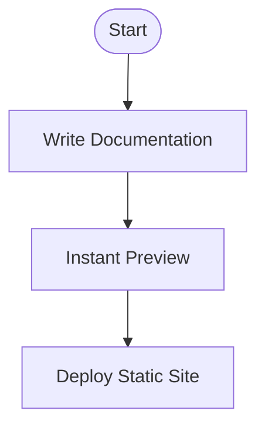

# Features at a Glance

Discover the core strengths that make Dory the ideal choice for building fast, clean, and developer-friendly technical documentation sites. This page highlights Dory’s standout features with an emphasis on user value—what each feature enables you to achieve and why it matters.

---

## Key Features Summary

### 1. Native MDX Support
Write your documentation using MDX, which blends Markdown’s simplicity with the power of JSX. This means:
- Seamless authoring of rich content — mix text, code, and React-style components.
- Easily embed custom interactive UI elements directly in your docs.
- Maintain one source format for both content and design.

<CodeGroup>
```mdx
# Getting Started with Dory

Welcome to easy, maintainable docs powered by MDX.

<CustomAlert type="info">Remember to customize your dory.json!</CustomAlert>
```
```tsx
import { useState } from 'preact/hooks';

function CustomAlert({ type, children }) {
  return <div className={`alert alert-${type}`}>{children}</div>;
}
```
</CodeGroup>

<Info>
MDX support unlocks flexibility, letting you balance simplicity with power — write markdown or add components as needed.
</Info>

---

### 2. Single-File Configuration (`dory.json`)
Configure your entire site structure, navigation, and branding using one simple JSON file. This means:
- Centralized control over your documentation hierarchy
- Easy adjustments to navigation, theming, and footer details
- No complex config spread across multiple files

<Tip>
Keep your `dory.json` minimal and readable to enable quick updates and collaboration.
</Tip>

---

### 3. Instant Hot Reload in Development
Experience near-instant feedback as you author docs:
- Live reload on content or configuration changes
- No manual page refresh required
- Reduces development cycle time dramatically

---

### 4. Built-in Navigation and Layout
Dory provides pre-built, responsive navigation and clean layouts that:
- Organize your documentation clearly and intuitively
- Adapt seamlessly to different screen sizes and devices
- Include search, dark mode toggle, and nested menus by default

---

### 5. Mermaid.js Diagram Support
Create and display powerful, dynamic diagrams directly in your documentation using Mermaid syntax:
- Flowcharts, sequence diagrams, Gantt charts, class diagrams, and more
- Visualize complex workflows and architectures clearly
- Keep diagrams version-controlled alongside docs



<Tip>
Utilize Mermaid to make your docs visually engaging and easier to understand.
</Tip>

---

### 6. Customization Powered by Tailwind CSS
Control the styling and appearance with utility-first CSS:
- Override colors, spacing, typography to fit your brand
- Customize without needing to rewrite components
- Tailwind’s familiar syntax accelerates styling

---

### 7. API Playground with OpenAPI Support
Easily embed interactive API documentation generated from your OpenAPI specs:
- Test HTTP endpoints directly from docs
- View detailed request/response schemas
- Provide live examples that enhance developer experience

<Info>
This integration simplifies API docs maintenance—no more stale or disconnected references.
</Info>

---

## Why These Features Matter
Dory’s feature set is designed around a simple premise: empower developers and technical writers to produce documentation that is both beautiful and easy to maintain, without overhead.

- **Productivity:** Hot reload and MDX let you iterate faster.
- **Usability:** Built-in navigation and diagramming enhance clarity.
- **Consistency:** Central config and Tailwind-based styling keep your site cohesive and brand-aligned.
- **Interactivity:** API playgrounds foster hands-on understanding.

This combination supports modern documentation needs for internal teams, open source projects, and API-driven products alike.

---

## Real-World Example: From Writing to Publishing
Imagine you are documenting a new API:

1. Add a new `.mdx` file describing your API endpoint.
2. Reference your OpenAPI spec to automatically generate a testable API playground.
3. Include a Mermaid flowchart that visualizes request handling.
4. Use your single `dory.json` to place the new page in navigation.
5. Save and immediately see your changes reflected — no wait, no fuss.
6. When ready, run `dory build` to produce a fast, static site deployable anywhere.

This streamlined flow reduces friction and errors in your documentation lifecycle.

---

## Getting Started
To explore these features hands-on:

- Read the [Initialize Your Documentation Project](../getting-started/project-setup/create-project) guide.
- Configure your site with the [dory.json file](../getting-started/project-setup/configure-dory).
- See how to [Add & Structure Documentation Content](../getting-started/project-setup/add-docs).
- Preview functionality with [Run the Development Server](../getting-started/first-run-validation/start-development-server).

Harness the power of Dory’s features to accelerate your documentation workflow.

---

## Troubleshooting Common Feature Issues
<AccordionGroup title="Feature Troubleshooting Tips">
<Accordion title="MDX Content Not Updating">
Ensure your development server is running with hot reload (pnpm run dev). Check your file path and extension.
</Accordion>
<Accordion title="Mermaid Diagrams Not Rendering">
Verify Mermaid syntax correctness in your MDX code block. Try refreshing the page if hot reload misses the change.
</Accordion>
<Accordion title="Navigation Missing New Pages">
Confirm `dory.json` includes the new pages. Navigation is driven entirely by this config file.
</Accordion>
<Accordion title="API Playground Not Showing"
>
Make sure your OpenAPI spec is correctly linked and accessible under the proper directory matching the docs path.
</Accordion>
</AccordionGroup>

---

Unlock the full power of Dory by leveraging these features to create documentation that developers love to use and maintain.


<Source url="https://github.com/clidey/dory" paths={[{"path": "docs/overview/feature-overview/features-at-a-glance.mdx", "range": "1-100"}]} />
